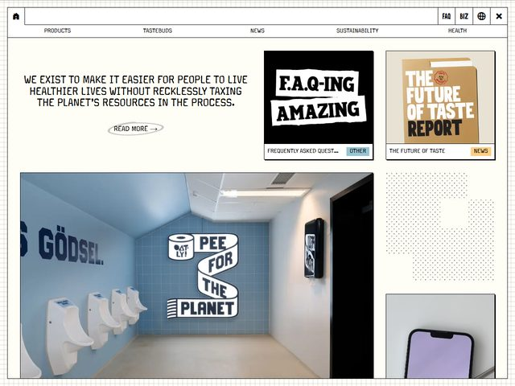

# Oatly — https://www.oatly.com

- **niche:** food
- **mood:** warm-playful
- **style:** editorial, hand-lettered, zine, off-beat
- **palette:** bg `#F2F0E6` · ink `#1A2436` · accent `#A9CBE0` — Um azul-azulejo gizado que só aparece dentro da foto (a parede do banheiro) e como uma pequena tag ("OTHER"); a marca resiste a uma cor de marketing e deixa o azul-marinho-tinta fazer quase todo o trabalho.
- **type:** display *lettering de pincel/marcador desenhado à mão, painéis vazados sobre preto (à la uma fonte custom tipo "Oatly Display" / Tungsten áspera)* · body *grotesca condensada em caixa-alta, levemente irregular (pense numa League Gothic peculiar / GT America Condensed)* — irônica, lo-fi, fala-com-você-como-um-amigo.
- **sections:** hero › manifesto-strip › products-grid › sustainability-report › faq › cta › footer
- **signature:** O hero troca a esperada foto glamourosa da embalagem por uma foto documental e impassível de uma fileira de mictórios num banheiro público azulejado, legendada com lettering pintado à mão que diz "PEE FOR THE PLANET" e o estêncil na parede "GÖDSEL." Autoconsciente, quase anti-design: o layout é um grid modular improvisado de cards preto-e-bege (um painel "F.A.Q-ING AMAZING", um card "THE FUTURE OF TASTE REPORT") que parece mais uma página de zine colada à mão do que uma home DTC.
- **imagery:** Fotografia real, mas intencionalmente sem produção e estranha (um banheiro com luz fluorescente, não uma cozinha), sobreposta com placas em lettering à mão e manchetes de marcador escaneadas sobre blocos pretos chapados. Sem 3D, sem brilho; o charme está na textura caseira, de fotocópia.
- **copy:** Manifesto em linguagem direta, montado como um bloco à esquerda meio datilografado: "WE EXIST TO MAKE IT EASIER FOR PEOPLE TO LIVE HEALTHIER LIVES WITHOUT RECKLESSLY TAXING THE PLANET'S RESOURCES IN THE PROCESS." com uma pequena pílula "READ MORE →". Os eyebrows dos cards fazem trocadilhos sem parar — "F.A.Q-ING AMAZING" sobre "FREQUENTLY ASKED QUEST…", e "THE FUTURE OF TASTE REPORT" marcado como "NEWS".

**Takeaways (roube como ideias, não copie):**
- Substitua a óbvia foto glamourosa do produto por uma foto do mundo real impassível, quase feia, e deixe um trocadilho de uma linha fazer a venda — a surpresa vence o capricho.
- Construa a página como um grid colado à mão de cards pretos/bege com manchetes em lettering manual para que pareça uma zine, não um template.
- Mantenha a paleta em papel quente + azul-marinho-tinta e recuse uma cor de marca estridente; deixe a tipografia e o texto carregarem toda a personalidade.
- Apoie-se em trocadilhos e numa voz de manifesto em primeira pessoa ("WE EXIST TO…") para fazer uma commodity (leite de aveia) parecer um ponto de vista.
