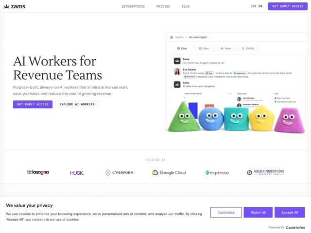

# Obviously — https://obviously.ai

- **niche:** ai
- **mood:** clean-light
- **style:** minimal, illustrated, clean-light
- **palette:** bg `#FFFFFF` · ink `#1A1A1A` · accent `#6C5CE7` — Primary CTA buttons (Get Early Access), nav button, and active-tab/link highlights inside the product mockup
- **type:** display *Serif (high-contrast transitional serif, Times/Tiempos-like)* · body *Geometric/grotesque sans-serif* — Editorial-meets-utility: a literary serif headline grounds a no-nonsense sans body and ALL-CAPS letterspaced mono-flavored labels, signaling 'serious software with taste' rather than typical AI-startup futurism
- **sections:** hero › logos › feature-meet-the-workers › feature-meeting-intelligence › feature-crm-automation › feature-account-monitoring › feature-call-to-accounts › feature-linkedin-pipeline › feature-custom-workers › how-it-works › feature-connect-integrations › feature-data-privacy › testimonials › cta › footer
- **signature:** Fuzzy, googly-eyed felt-craft geometric mascots (a green pyramid, blue ball, teal cube, yellow star, pink cone) parked under a sleek SaaS dashboard — tactile, handmade, almost children's-toy charm in a category that defaults to cold gradients, glowing orbs and abstract neural-net visuals
- **imagery:** Two contrasting registers side by side: a clean, realistic product UI screenshot (chat agent enriching leads, syncing to Salesforce, with mini bar charts and avatar rows) paired with photographic 3D-felt physical mascots. The toy-like 'AI Workers' literally embody the abstract product; logo wall is grayscale-to-color brand marks on plain white
- **copy:** Plain-spoken outcome-first claims in a confident serif voice — hero reads 'AI Workers for Revenue Teams' with subhead 'Purpose-built, always-on AI workers that eliminate manual work, save you hours and reduce the cost of growing revenue.'

**Takeaways (steal as ideas, don't copy):**
- Pair one literary serif display face with a plain sans body and ALL-CAPS letterspaced labels to read 'editorial taste' instead of 'AI startup' — typography alone differentiates the genre
- Personify an abstract AI product with tactile, characterful mascots (felt, googly eyes) to add warmth and make 'workers' feel literal and friendly
- Anchor the hero with a real, populated product screenshot showing the actual workflow (enrich -> create lead -> sequence) rather than a vague abstract visual — it sells the 'how' instantly
- Use section headings as outcome promises in everyday language ('Zero manual CRM work. Ever again.') so the feature list reads like benefits, not specs
