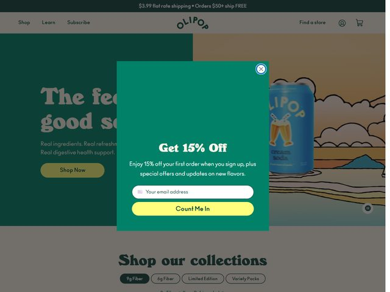

# OLIPOP — https://drinkolipop.com

- **niche:** food
- **mood:** warm-playful
- **style:** retro, illustrated, soda-shop, nostalgic
- **palette:** bg `#1E5C4A` · ink `#F2E7C9` · accent `#F3E04A` — Tela verde-floresta profundo com tipografia creme e quente; um amarelo amanteigado anos 1970 faz todo o trabalho nos CTAs em pílula ("Shop Now", "Count Me In") e é ecoado no gradiente de pôr do sol da cena ilustrada. O acento se lê como um letreiro de soda fountain, não um botão de tech.
- **type:** display *slab retrô robusta / soft-serif workhorse (pense em algo tipo Cooper ou uma Recoleta arredondada)* · body *sans humanista (Aktiv Grotesk / Inter) em creme suave* — Voz amigável, de balcão de soda vintage; o display é gordinho e curvilíneo enquanto o corpo permanece calmo.
- **sections:** hero › shop-our-collections › benefits-real-ingredients › flavors-grid › reviews › press-as-seen-in › cta › footer
- **signature:** O hero é dividido ao meio: um painel chapado verde-floresta à esquerda abriga o wordmark + a manchete creme robusta, enquanto a metade direita é uma paisagem de pôster de viagem retrô desenhada à mão — nuvens em camadas, um horizonte de pôr do sol, um lago e a lata "Cream Soda" da OLIPOP plantada na cena como um outdoor de beira de estrada. Ela enquadra um refrigerante funcional de saúde intestinal como uma nostálgica Americana em vez de um wellness clínico, e até o wordmark "OLIPOP" curvado em arco imita uma tampinha de garrafa vintage.
- **imagery:** Voltada à ilustração, não à fotografia — uma cena de pôster estilizada (nuvens em faixas, pôr do sol geométrico, água calma) com a lata real do produto compostada como objeto focal. Campos de cor chapada, contornos visíveis, sombreamento retrô sem meio-tom; um pequeno botão de play de vídeo paira sobre a arte sugerindo um loop em autoplay.
- **copy:** Texto saudável de lanchonete, com benefícios empilhados. A manchete diz "The feel good soda" (parcialmente escondida atrás do modal), apoiada por "Real ingredients. Real refresh[ment]. Real digestive health support." O pop-up de e-mail abre com "Get 15% Off" e "Enjoy 15% off your first order when you sign up, plus special offers and updates on new flavors," com um botão de envio brincalhão rotulado "Count Me In."

**Takeaways (roube como ideias, não copie):**
- Divida a dobra 50/50: painel chapado na cor da marca para a tipografia de um lado, um mundo ilustrado em full-bleed segurando o produto do outro — nenhuma foto de hero necessária.
- Curve o wordmark em arco para evocar uma tampinha de garrafa / emblema; isso sinaliza instantaneamente herança e artesanato para uma marca de consumo.
- Apoie-se num único acento quente (amarelo amanteigado) para cada CTA em pílula e deixe-o reaparecer dentro do pôr do sol da ilustração para que o botão pareça nativo da cena.
- Venda função com nostalgia: o texto em tríplice anáfora ("Real ingredients. Real refreshment. Real digestive health support.") faz uma promessa de saúde intestinal parecer uma promessa de refrigerante à moda antiga.
