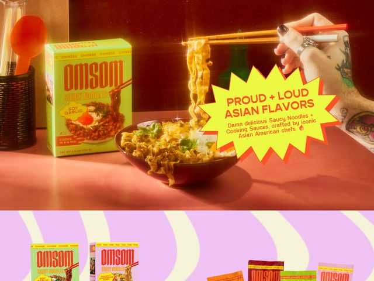

# Omsom — https://omsom.com

- **niche:** food
- **mood:** bold-loud
- **style:** maximalist, photographic, retro, saturated
- **palette:** bg `#C96A4F` · ink `#E8442C` · accent `#E9F25A` — Acid chartreuse yellow is reserved for the jagged comic-book starburst badge that overlays the hero photo; the whole frame floats on a warm terracotta-clay tabletop, with a tomato-red used for the headline type inside the badge and on the box packaging.
- **type:** display *condensed bold sans, Druk Condensed / Compacta vibe (heavy, all-caps, tightly stacked)* · body *rounded humanist sans, e.g. Sharp Grotesk or a softened Helvetica* — Punchy, brash, packaging-grade — type behaves like a sticker, not a paragraph.
- **sections:** hero › product-grid › flavor-story › chef-collabs › how-it-works › reviews › cta › footer
- **signature:** The hero isn't a clean studio shot — it's a styled, slightly overexposed lifestyle photo (a tattooed hand lifting saucy noodles with chopsticks, steam rising, a green retro instant-noodle box beside the bowl) with a hand-drawn comic starburst badge slapped on top. The badge's spiky cartoon outline plus the deliberately blown-out, warm color grade makes it read like a vintage zine ad rather than a DTC food site. The grungy, real, lived-in hand (tattoos, painted nails, watch) sells authenticity over sterile perfection.
- **imagery:** Photographic and proudly imperfect — heavy warm color grading, visible steam, real human hands, branded packaging in frame. A repeating wavy purple-and-lilac band runs below the fold with rows of product boxes, giving a playful pattern-based rhythm under the editorial hero.
- **copy:** Loud, irreverent, unapologetically proud — the starburst badge shouts 'PROUD + LOUD ASIAN FLAVORS' with subhead 'Damn delicious Saucy Noodles + Cooking Sauces, crafted by iconic Asian American chefs'. Packaging copy reads 'OMSOM SAUCY NOODLES — SOY GARLIC' and the eyebrow strip 'CHINESE CHINESE CHINESE'.

**Takeaways (steal as ideas, don't copy):**
- Overlay a hand-drawn comic starburst in a single acid-bright accent on a richly graded photo to make a flat hero feel loud and zine-like.
- Use a deliberately warm, slightly overexposed color grade and real, imperfect human hands (tattoos, steam, lived-in props) to sell authenticity over sterile studio polish.
- Let packaging be the product shot: keep the actual branded box in the frame so the hero doubles as a shelf-recognition cue.
- Carry a repeating wavy two-tone band below the fold to set a playful, pattern-driven rhythm that contrasts the editorial photo above.
