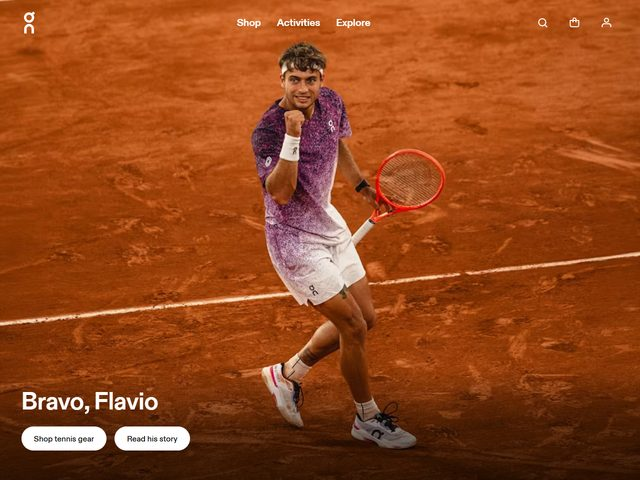

# On — https://www.on.com

- **niche:** fitness
- **mood:** bold-loud
- **style:** photographic, full-bleed, athletic, editorial
- **palette:** bg `#A8421C` · ink `#FFFFFF` · accent `#FF5436` — There is no graphic accent layer; the color comes entirely from the photo itself — the burnt clay-court orange floods the whole frame and the neon-coral tennis racquet is the single pop of saturated red against the athlete's purple-to-white kit.
- **type:** display *neo-grotesque sans, tight and bold (Helvetica Now / On's custom grotesque)* · body *same grotesque family, regular* — Confident and clipped; type stays out of the photo's way and lets the moment carry the emotion.
- **sections:** hero › athlete-story › featured-product-grid › technology (CloudTec / cushioning) › activities › sustainability › cta › footer
- **signature:** The fold is a single un-staged sports-photography frame — Flavio Cobolli mid fist-pump on a Roland-Garros clay court, shot full-bleed so the saturated orange clay becomes the entire background and palette. No product cut-out, no studio gradient, no marketing graphics; the headline 'Bravo, Flavio' sits tiny in the bottom-left like a caption, letting the athlete's raw celebration be the whole hero. It treats a moment of sport, not a shoe, as the selling argument.
- **imagery:** Documentary action photography, full-bleed and color-graded warm — real match moment with motion in the kit and a slight in-frame energy. Zero illustration, zero 3D, no product hero shot above the fold; the shoes and apparel are present only because the athlete is wearing them.
- **copy:** Warm, first-name and human — congratulatory rather than salesy. Visible headline 'Bravo, Flavio' with two pill buttons 'Shop tennis gear' and 'Read his story'.

**Takeaways (steal as ideas, don't copy):**
- Let a single documentary action photo BE the palette — grade the whole hero to one dominant environmental color (clay orange) instead of layering brand graphics on top.
- Caption-style headline: drop a tiny bottom-left title like a photo credit so the image, not the words, owns the fold.
- Pair an emotional CTA ('Read his story') beside the commercial one ('Shop tennis gear') to sell the narrative before the product.
- Make the product implicit — show it worn in a real moment rather than as a cut-out, so the gear inherits the athlete's credibility.
