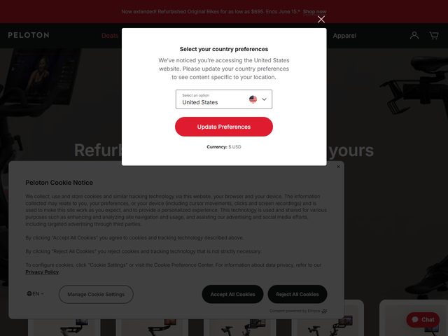

# Peloton — https://www.onepeloton.com

- **niche:** fitness
- **mood:** bold-loud
- **style:** dark, photographic, product-hero, high-contrast
- **palette:** bg `#1A1110` · ink `#FFFFFF` · accent `#E1142E` — A single saturated Peloton red, deployed only on conversion surfaces: the top promo bar ("Now extended! Refurbished Original Bikes…"), the pill CTA, and the floating "Chat" tab. Everything else is white type on a near-black, warm-tinted studio backdrop.
- **type:** display *Neue Haas Grotesk / Helvetica-style grotesque, heavy weight, generous size* · body *clean neo-grotesque sans, regular* — Athletic and confident; the wordmark "PELOTON" is wide-tracked all-caps, the headline is tight and bold.
- **sections:** hero › bike-lineup › class-library › membership-benefits › app-cross-sell › social-proof › cta › footer
- **signature:** The fold stages the actual hardware in a dim, moody product-photography set — Peloton Bikes shot at an angle against a black studio gradient, lit like a car ad rather than a gym. The oversized white headline ("Refurb… yours") is laid directly over the machines so the product and the promise share one frame, with the red promo bar pinned above as a permanent urgency banner.
- **imagery:** Photographic, not 3D or illustration. Editorial studio shots of the connected bikes — low-key lighting, reflective floor, warm shadows — treated as aspirational hero objects. The page reads as catalog-meets-showroom; below the fold a row of product cards (bikes/treads) continues the same dark photographic language.
- **copy:** Punchy, value-led retail voice. Headline (partly obscured by the modal) reads **"Refurb… yours"** — i.e. "Refurbished. Now yours." — with the promo eyebrow **"Now extended! Refurbished Original Bikes for as low as $695. Ends June 15.*"** and a **"Shop now"** prompt. Plain price-and-product messaging, not lifestyle poetry.

**Takeaways (steal as ideas, don't copy):**
- Shoot the physical product like a luxury object — dim studio set, warm shadows, reflective floor — so hardware carries the hero instead of stock gym lifestyle photos.
- Restrict your one saturated accent (red) to pure conversion surfaces only: promo bar, primary CTA, chat tab. Keep the rest monochrome so every red pixel means "act now."
- Pin a thin urgency strip above the nav with a live offer and a deadline ("Ends June 15.*") to create permanent scarcity without crowding the hero.
- Use a warm-tinted near-black (`#1A1110`) rather than pure black so studio photography blends into the canvas and skin/metal tones stay flattering.
