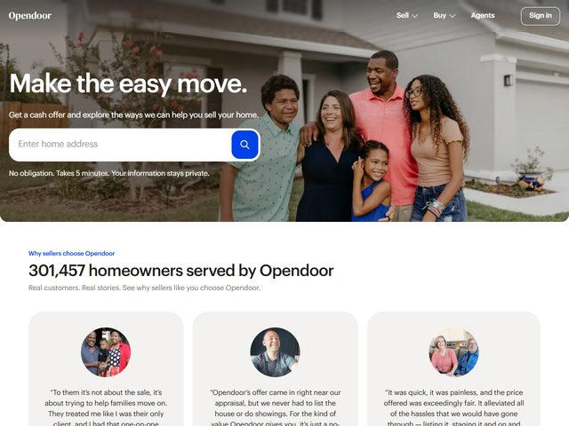

# Opendoor — https://www.opendoor.com

- **niche:** home
- **mood:** clean-light
- **style:** photographic, lifestyle, friendly, consumer
- **palette:** bg `#FFFFFF` · ink `#1A1A1A` · accent `#1450E0` — O azul-real vive quase inteiramente no botão redondo de busca em formato de lupa soldado à barra de endereço; é o único estouro saturado de UI num quadro de resto fotográfico e quente, e reaparece minúsculo como o eyebrow "Why sellers choose Opendoor" abaixo da dobra.
- **type:** display *grotesca geométrica, peso muito pesado — tipo uma "Opendoor Sans" custom / Inter Black ou Aktiv Grotesk Bold* · body *sans humanista limpa (Inter / Helvetica Now), em cinza regular* — Direta e tranquilizadora; a manchete grita confiança, o texto de apoio sussurra logística.
- **sections:** hero › social-proof-counter › seller-testimonials › how-it-works-steps › cash-offer-explainer › buy-with-opendoor › trust-and-fees › cta › footer
- **signature:** A dobra é uma única fotografia espontânea de borda a borda de uma família multigeracional real — cinco pessoas, três gerações, de braços dados, rindo em frente a uma casa de estuque iluminada pelo sol — e a manchete + busca flutuam diretamente sobre o terço esquerdo mais escuro dessa foto, sem card, painel de scrim ou container. O produto é literalmente um campo de endereço incrustado no quintal da família. Vende o resultado emocional (pessoas, juntas, seguindo em frente) enquanto a única coisa que você de fato faz é digitar um endereço.
- **imagery:** Fotografia editorial de estilo de vida em full-bleed, naturalista e quente (luz dourada de subúrbio, expressões espontâneas reais, nada de pose rígida de banco de imagens). Sem 3D, sem ilustração, sem screenshots de UI de produto no hero. Abaixo da dobra muda para fotos de retrato com recorte circular de clientes reais nomeados ancorando cada depoimento.
- **copy:** Confiante, monossilábica, benefício em primeiro lugar. Manchete: "Make the easy move." Subtítulo: "Get a cash offer and explore the ways we can help you sell your home." O microcopy sob a barra de busca tranquiliza sobre atrito e privacidade: "No obligation. Takes 5 minutes. Your information stays private." Eyebrow de seção: "Why sellers choose Opendoor" sobre a estatística "301,457 homeowners served by Opendoor" com subtítulo "Real customers. Real stories. See why sellers like you choose Opendoor."

**Takeaways (roube como ideias, não copie):**
- Faça a manchete e o input primário flutuarem diretamente sobre uma foto de estilo de vida em full-bleed sem card — a composição (um quadrante mais escuro da foto) faz o trabalho de legibilidade em vez de um painel de UI.
- Faça da ação central de conversão um único campo de baixo compromisso (só "Enter home address") e reduza o risco inline com um trio de eliminadores de atrito: tempo, obrigação, privacidade.
- Reserve o único acento saturado apenas para o botão de envio, para que o olho seja afunilado para a única coisa que você quer que seja clicada num quadro de resto quente e neutro.
- Comece a seção de prova com um contador ao vivo preciso e estranhamente específico ("301,457 homeowners") — o número não arredondado se lê como uma consulta real de banco de dados, não como arredondamento de marketing.
