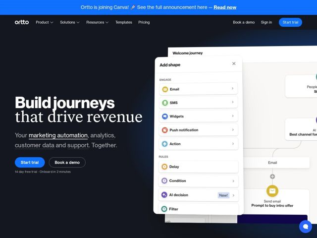

# Ortto — https://ortto.com

- **niche:** marketing
- **mood:** technical-dark
- **style:** dark, minimal, mono-type
- **palette:** bg `#161B22` · ink `#FFFFFF` · accent `#1F6FFF` — primary CTA buttons (Start trial), top announcement bar, and product-UI mock accents (email/SMS node icons)
- **type:** display *Geometric grotesque sans (heavy weight, tight tracking — Aktiv/Founders Grotesk feel)* · body *Clean humanist sans, regular weight* — Confident and editorial — an oversized two-tone headline (one word bold, one word lighter) reads like a magazine cover rather than a typical SaaS hero
- **sections:** hero › feature-marketing-automation › feature-customer-data-analytics › feature-support › feature-security-privacy › cta › footer
- **signature:** The hero hands the entire right half of the screen to a live, layered product mock — a real journey-builder canvas with an "Add shape" panel floating in front of an "Welcome journey" flowchart. Instead of a flat hero illustration, it stacks two overlapping UI surfaces with soft shadows so the tool literally appears mid-edit, breaking the convention of a single clean screenshot.
- **imagery:** Photoreal product UI rendered as floating, overlapping cards (panel + canvas) with rounded corners, drop shadows, and colorful per-feature icon chips (email/SMS/push/AI nodes). The bright white UI cards pop hard against the near-black hero, doing the visual heavy-lifting in place of photography or abstract art.
- **copy:** Bold two-tone benefit headline plus an underlined-keyword subhead listing the product pillars — "Build journeys that drive revenue" / "Your marketing automation, analytics, customer data and support. Together."

**Takeaways (steal as ideas, don't copy):**
- Two-tone headline: render the verb/key noun in heavy bold and the rest in a lighter weight on the next line, so the hero has built-in hierarchy with one typeface.
- Turn the subhead into a feature index — underline each product pillar word (marketing automation, analytics, customer data, support) as inline links so the value prop doubles as navigation.
- Stack two overlapping product surfaces (a modal panel over a canvas) with soft shadows to suggest the tool is live and in-use, not a static screenshot.
- Pin a micro-reassurance line directly under the CTAs ('14 day free trial - Onboard in 2 minutes') to kill friction at the click moment.
