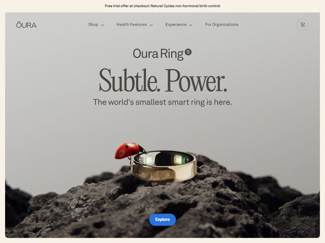

# Oura — https://ouraring.com

- **niche:** health
- **mood:** premium-luxe
- **style:** photographic, editorial, minimal, product-hero
- **palette:** bg `#D8D9D6` · ink `#3B3A36` · accent `#2F6BFF` — A cool blue used only on the small "Explore" pill CTA floating over the photo; everywhere else is warm greige and the metallic gold/black of the ring itself, so the single blue button is the only saturated mark on the page.
- **type:** display *high-contrast editorial serif (Canela / GT Sectra feel) — "Subtle. Power." set huge with full stops as deliberate beats* · body *humanist sans (Brown / Akkurat-ish) for the subhead and nav* — Restrained, confident, jewelry-catalogue cadence; the serif does the talking, the sans gets out of the way.
- **sections:** hero › value-props (sleep / readiness / activity) › ring-detail-and-materials › membership-app › science-and-accuracy › testimonials › comparison › cta › footer
- **signature:** The hero is a macro product still-life shot, not a render: the gold-and-black Oura ring sits balanced on rough black volcanic rock, and a real ladybug is perched climbing the rim — a tiny living thing scaled against the ring to dramatize "the world's smallest smart ring." That single insect does all the storytelling about size and delicacy without a callout or a spec.
- **imagery:** Editorial macro photography on a soft greige seamless backdrop. Shallow depth of field, natural soft light, real textures (matte volcanic stone, polished metal, the ladybug's gloss). Zero UI, zero 3D, zero illustration — the object is treated like a luxury watch in a magazine.
- **copy:** Sparse, declarative, luxury-goods voice. Eyebrow "Oura Ring 5" (with a small circled "5"), headline "Subtle. Power." (two one-word sentences), subhead "The world's smallest smart ring is here." A promo bar up top reads "Free trial offer at checkout: Natural Cycles non-hormonal birth control."

**Takeaways (steal as ideas, don't copy):**
- Prove a product claim ("smallest") with scale-against-life — put a real small living thing next to the object instead of writing dimensions.
- Punctuate a two-word headline into two full sentences ("Subtle. Power.") so each word lands as its own beat.
- Keep the entire frame desaturated greige + metal and reserve one saturated blue only for the lone CTA pill, so the eye goes straight to the action.
- Shoot the product as luxury still-life on textured natural material (volcanic rock) to push a tech device into jewelry territory.
