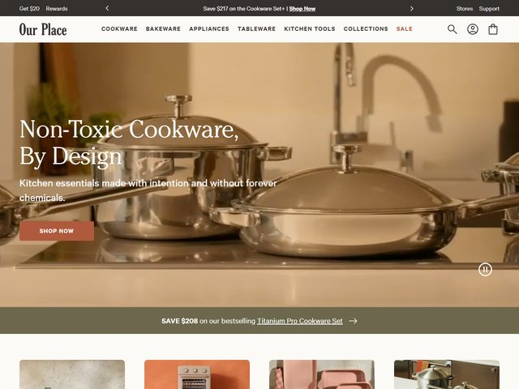

# Our Place — https://fromourplace.com

- **niche:** home
- **mood:** warm-playful
- **style:** photographic, warm, editorial, lifestyle
- **palette:** bg `#EFE6D8` · ink `#2E2A24` · accent `#C06A4E` — The terracotta/clay accent lives almost entirely on the solid "SHOP NOW" CTA pill and the "SALE" nav link; the rest of the page leans on the warm sand photo and a sage-olive promo bar, so the accent reads as the one place to click.
- **type:** display *high-contrast editorial serif (Canela / Tiempos Headline feel), generous size, headline-cased* · body *clean humanist sans (Founders Grotesk / Apercu feel), small and quiet* — Boutique and considered; the serif does the talking, the sans just supports.
- **sections:** hero › category-grid › non-toxic-story › bestseller-cookware › reviews-social-proof › bundle-builder › cta › footer
- **signature:** The hero is a tight, softly-lit lifestyle photograph of gleaming stainless cookware sitting on a real stovetop — steam-warm, shallow depth of field, shot in a sand-and-cream kitchen rather than on seamless studio white. White serif type is laid directly over the photo at the left, and a tiny pause (⏸) control in the lower right reveals it's actually a looping video, not a still. It feels like an interiors magazine spread that happens to sell pans.
- **imagery:** Photography only — warm, naturally-lit, lived-in product-in-context (cookware staged on a counter/stovetop, no isolated packshots in the fold). Below, a row of color-blocked category tiles in coordinating clay/blush/sage tones continues the warm palette.
- **copy:** Calm, design-forward and benefit-led. Headline: "Non-Toxic Cookware, By Design"; subhead: "Kitchen essentials made with intention and without forever chemicals." A thin sage banner cross-sells: "SAVE $208 on our bestselling Titanium Pro Cookware Set", with a top utility bar offering "Save $217 on the Cookware Set + Shop Now".

**Takeaways (steal as ideas, don't copy):**
- Shoot the hero as a warm, lived-in lifestyle scene on a real surface with shallow depth of field instead of a seamless studio packshot — it makes a commodity product feel editorial.
- Quietly run the hero as a looping video and expose only a small pause glyph in the corner, so motion adds life without a heavy player UI.
- Pull the entire palette from the photograph itself (sand bg, clay CTA, sage promo bar) so chrome and product read as one coordinated set.
- Lead with a values headline ("Non-Toxic … without forever chemicals") set in an editorial serif, letting the design promise carry the sales pitch instead of a discount.
