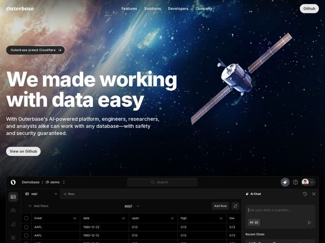

# Outerbase — https://outerbase.com

- **niche:** data
- **mood:** premium-luxe
- **style:** dark, photographic, 3d
- **palette:** bg `#0B1020` · ink `#F4F6FB` · accent `#3A6FD8` — O brilho atmosférico azul da Terra na foto do hero, contornos/links de botões, o botão de envio do AI Chat e os ícones de acento na UI de produto embutida; contido — a cor vem principalmente do fundo fotográfico em vez de preenchimentos chapados de marca
- **type:** display *sans grotesca geométrica (classe Helvetica Now / Neue Haas Grotesk, tracking ultra-apertado)* · body *sans humanista neutra (classe Inter)* — Pesada, com sensação de condensada, confiança de pôster da NASA; espaçamento entre letras quase zero para que a manchete se leia como uma parede sólida de tipografia
- **sections:** hero › feature-ai › logos › feature-navigate › feature-insights › feature-byo-database › feature-control › feature-security › cta › footer
- **signature:** Um hero fotorrealista em full-bleed da Terra vista da órbita + satélite, onde a manchete fica na metade do espaço escuro e o produto literalmente parece estar 'em órbita' — o terminador do planeta (linha dia/noite) funciona também como o gradiente de contraste que faz a tipografia branca saltar no lado escuro e a tipografia escura ficar legível no lado iluminado.
- **imagery:** Fotografia espacial cinematográfica (curvatura real da Terra, satélite, campo de estrelas) para o hero, fazendo a transição para baixo até uma UI nítida de screenshot de produto — a tabela de banco de dados real + o painel do AI Chat — flutuando sobre o gradiente escuro. A foto é a marca; a foto do produto é a prova. Sem blobs 3D abstratos.
- **copy:** Promessa de resultado direta em vez de jargão — 'We made working with data easy' — confiante, em primeira pessoa do plural, com subtítulo nomeando o público (engineers, researchers, analysts) e o ganho (safety and security guaranteed).

**Takeaways (roube como ideias, não copie):**
- Deixe uma única imagem de hero fotorrealista fazer o trabalho de cor: mantenha os preenchimentos de marca quase monocromáticos (azul-marinho escuro + tipografia branca) e tire seu acento — aqui um brilho planetário azul — da própria fotografia, para que a página pareça premium sem uma paleta estridente.
- Use um gradiente ambiental real (o terminador dia/noite do planeta) em vez de um gradiente CSS para carregar o contraste: tipografia branca no lado da noite, UI de produto emergindo do lado iluminado. O 'gradiente' tem significado narrativo.
- Superdimensione a manchete para uma parede de tipografia de tracking apertado que abrange a coluna de borda a borda ('We made working with data easy' com cerca da largura do hero), e então aterre imediatamente a abstração com um screenshot literal do produto mais abaixo no mesmo scroll.
- Nomeie segurança como um cluster de recursos de pequenos chips concretos em h3 (Two-Factor Auth, HIPAA, SOC 2 Type 2, SSH Tunneling, Data Encryption) — uma grade de termos de conformidade se lê como 'pronto para enterprise' mais rápido do que um parágrafo para um público de dados/dev.
