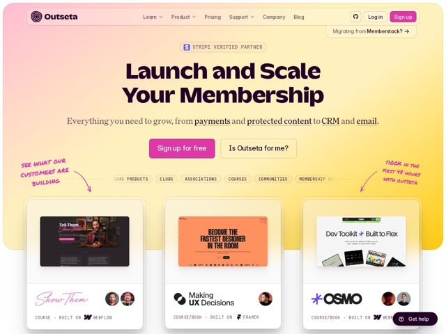

# Outseta — https://outseta.com

- **niche:** crm
- **mood:** warm-playful
- **style:** gradient, colorful, bento
- **palette:** bg `#F6D98C` · ink `#241A14` · accent `#E0218A` — primary CTA button fill ('Sign up for free'), 'Sign up' nav pill, marker-script handwriting accents, pink highlights inside product cards
- **type:** display *Kaio* · body *Inter Var* — Display is a chunky rounded condensed sans (Kaio) — bold, friendly, almost cartoonish weight; body is clean neutral Inter with serif-italic inline links for warmth. Plus a marker-script for annotations.
- **sections:** hero › logos › feature-styling › feature-embeds › feature-newsletter › feature-all-in-one › problem › cta › footer
- **signature:** Hand-drawn marker annotations with curved arrows flanking the hero ("SEE WHAT OUR CUSTOMERS ARE BUILDING" pointing left into the cards, "$100K IN THE FIRST 48 HOURS WITH OUTSETA" pointing right) — scrappy human handwriting layered over a polished gradient, doubling as social proof.
- **imagery:** Real product-screenshot cards of actual customer sites (Show Them, Making UX Decisions, OSMO) presented as tilted/stacked browser tiles, each tagged with the no-code tool it was built on (Webflow, Framer) plus stacked customer avatars. Social proof IS the imagery — these are showcased customers, not mockups.
- **copy:** Capability-promise headline in plain language, no jargon. Hero: "Launch and Scale Your Membership" — confident imperative verbs, subhead spells out the stack with inline-underlined nouns (payments, protected content, CRM, email). Voice is encouraging and builder-to-builder.

**Takeaways (steal as ideas, don't copy):**
- Run a warm diagonal gradient mesh (peach-pink top-left bleeding to golden-yellow bottom-right) as the entire above-the-fold canvas, then float white product cards on top so they pop without hard section borders.
- Use a horizontal pill-chip row of use-cases (SAAS PRODUCTS / CLUBS / ASSOCIATIONS / COURSES / COMMUNITIES) as a lightweight audience selector that bridges hero copy and the proof cards below.
- Tag every customer screenshot with the tool it was built on (BUILT ON WEBFLOW / FRAMER) — turns a logo wall into credible 'people like you ship with this' proof.
- Pair a heavy rounded display face with a quiet Inter body and serif-italic inline links — the contrast keeps a playful hero from feeling juvenile.
