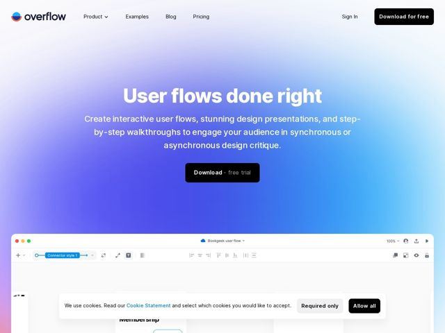

# Overflow — https://overflow.io

- **niche:** design
- **mood:** clean-light
- **style:** gradient, minimal, mono-type
- **palette:** bg `#6A5CF0` · ink `#1A1A2E` · accent `#2EA8FF` — brilho ciano do lado direito no gradiente do hero, chips de UI dos conectores dentro do app e destaques de link/CTA
- **type:** display *Geometric grotesque sans (Sofia Pro / Gilroy-style)* · body *Same humanist-geometric sans, regular weight* — amigável e confiante; os terminais geométricos arredondados a mantêm calorosa em vez de corporativa, e o peso bold da display dá um charme editorial
- **sections:** hero › feature-three-ways › feature-save-time › feature-story › feature-superpowers › testimonials › feature-wow-effect › how-it-works › cta › footer
- **signature:** O hero é um gradiente diagonal full-bleed de violeta para ciano com a tipografia branca flutuando bem no centro; então a própria UI do produto (uma tela de diagramação real com chrome de navegador) sobe pela borda inferior e se sobrepõe ao gradiente — a superfície de marketing literalmente passa o bastão para o app em funcionamento, em vez de mostrar um screenshot chapado dentro de um card.
- **imagery:** UI autêntica do produto como o artefato do hero — uma tela em janela macOS da ferramenta de diagramação com toolbars de conectores reais, controles de zoom e um quadro de fluxo de usuário de exemplo espiando por baixo da dobra. Sem foto de banco de imagens, sem 3D abstrato; o próprio software é a imagem, emoldurado em chrome esqueumórfico de navegador/janela para gerar confiança.
- **copy:** Slogans opinativos e focados no resultado do ofício; hero: "User flows done right" com o subgancho narrativo "One design story. Three ways to tell it."

**Takeaways (roube como ideias, não copie):**
- Deixe o gradiente do hero escorrer de borda a borda e faça flutuar a tipografia branca centralizada por cima; então quebre o quadro sobrepondo a UI viva do produto subindo pela base — profundidade sem um card de contenção.
- Use um gradiente direcional de dois tons (violeta frio varrendo para um ciano vibrante) para que o próprio fundo leia como movimento/luz em vez de um preenchimento de marca chapado.
- Estruture a página inteira como um arco narrativo de ganchos em H2 ('Tell your design story like never before', 'Discover your new superpowers') em vez de rótulos genéricos de recurso — o copy carrega a personalidade, não a decoração.
- Mantenha os CTAs como pílulas sólidas quase pretas contra o gradiente vibrante para máximo contraste, combinando um 'Download' em bold com um modificador discreto '- free trial' em peso mais leve.
