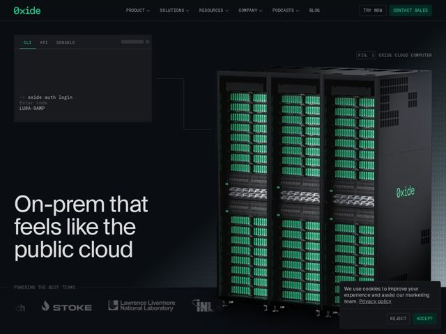

# Oxide — https://oxide.computer

- **niche:** infra
- **mood:** technical-dark
- **style:** dark, mono-type, photographic, minimal
- **palette:** bg `#0B0F0E` · ink `#E8EDEB` · accent `#48D597` — o logotipo, o sublinhado da aba ativa da CLI, o texto do prompt do terminal, os LEDs verdes literais nos racks dos servidores e o logo da Oxide serigrafado no chassi
- **type:** display *GT America Mono / Suisse Intl Mono (grotesque + monospace pairing)* · body *Suisse Intl-style neo-grotesque sans* — confiança de engenheiro: uma sans humanista para a grande afirmação, uma mono de largura fixa para tudo que sinaliza 'isto é uma máquina de verdade' (rótulos do nav, a legenda FIG.1, o terminal). Apertada, precisa, sem decoração.
- **sections:** hero › problem › feature-shift › feature-leap › feature-frontier-workloads › feature-unified-interface › feature-grid › logos › cta › newsletter › use-cases › footer
- **signature:** Um hero de produto fotorrealista literal: um rack de altura total com o servidor real da empresa e colunas de LEDs verdes acesas, iluminado como uma foto de moda contra o preto puro — vendendo infraestrutura de nuvem como um objeto físico que você pode possuir, o exato oposto das nuvens-blob de gradiente abstrato que todo concorrente de nuvem usa.
- **imagery:** Hardware fotorrealista com iluminação de estúdio (o rack da Oxide) fotografado sobre um quase-preto com uma sutil grade de blueprint e uma linha fina de conector ligando a janela flutuante da CLI à máquina. Uma legenda de engenharia "FIG. 1 / OXIDE CLOUD COMPUTER" o emoldura como uma chapa de spec-sheet. Os logos são marcas monocromáticas de laboratórios (ou afins): Lawrence Livermore, INL, STOKE.
- **copy:** Afirmações diretas, de engenheiro para engenheiro, que nomeiam um tradeoff real e o resolvem; hero: "On-prem that feels like the public cloud."

**Takeaways (roube como ideias, não copie):**
- Conecte a UI ao produto: uma janela de terminal flutuante (abas CLI/API/CONSOLE mostrando 'oxide auth login') ligada por uma linha literal ao rack — prova que a abstração mapeia para hardware real.
- Use o enquadramento de blueprint/figura ('FIG. 1', legenda em mono, grade sutil) para tomar emprestada a credibilidade de uma spec-sheet de engenharia em vez do verniz de marketing.
- Deixe que o próprio accent do produto seja físico — o verde da marca não é uma variável CSS, são os LEDs acesos na foto, então a paleta e o hardware são a mesma cor.
- Combine uma sans humanista para a única grande afirmação emocional com mono em todo lugar onde uma máquina fala (nav, legendas, terminal) para sinalizar legitimidade técnica.
