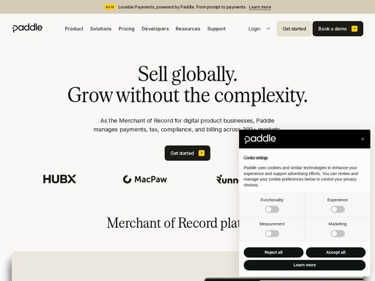

# Paddle — https://paddle.com

- **niche:** fintech
- **mood:** editorial-minimal
- **style:** editorial-minimal, mono-type, warm-neutral
- **palette:** bg `#F7F5F0` · ink `#1A1A1A` · accent `#F5C518` — pequenos glifos de seta dentro dos botões de CTA, a tag 'NEW' na barra de anúncio do topo e pequenos detalhes de ícone — nunca preenchimentos grandes
- **type:** display *serrifCondensed (high-contrast condensed serif, used at huge scale for the H1 and section heads)* · body *Inter (and Tiempos Text for some editorial body copy)* — a autoridade editorial do velho mundo encontra a precisão da fintech moderna — uma headline serifada literária, de capa de revista, carregando o sinal de confiança, equilibrada por uma sans neutra e limpa no texto funcional de apoio
- **sections:** announcement-bar › hero › logos › feature-merchant-of-record › feature-billing › feature-profitwell-metrics › feature-retain › problem › testimonials › how-it-works › case-study › pricing › cta › footer
- **signature:** Uma headline serifada condensada de alto contraste e dimensões enormes ("Sell globally. Grow without the complexity.") renderizada como a capa de um livro literário sobre um fundo de papel creme quente — rejeitando a convenção fria de gradiente-azul-mais-sans que define quase todo site de pagamentos/fintech.
- **imagery:** Escassa e contida: logotipos monocromáticos de clientes (HUBX, MacPaw, Runn) dispostos em uma fileira discreta, UI do produto espiando por baixo da dobra sobre um card off-white suave. Sem fotos de banco de imagens, sem 3D abstrato — a própria tipografia é a imagem do hero. Tela em tom de papel quente em vez de um branco clínico.
- **copy:** Declarações de benefício confiantes e diretas, em duas frases afirmativas curtas; o hero diz "Sell globally. Grow without the complexity." com o subtítulo posicionando a Paddle como "the Merchant of Record for digital product businesses."

**Takeaways (roube como ideias, não copie):**
- Use uma única headline serifada literária superdimensionada como todo o visual do hero, sobre um fundo creme quente (não branco) — deixe a tipografia carregar a marca em vez de imagens ou gradientes
- Restrinja seu accent apenas a micromomentos: um glifo de seta amarelo dentro do botão e uma tag 'NEW', para que a única cor vibrante leia como deliberada, não decorativa
- Combine uma display serifada condensada de alto contraste com o corpo Inter neutro para uma tensão de 'fintech editorial' — autoridade no topo, clareza abaixo
- Empilhe duas frases afirmativas curtas e impactantes de duas palavras como o H1 em vez de uma única linha longa de proposta de valor — escaneia como uma capa de revista e desacelera o leitor
