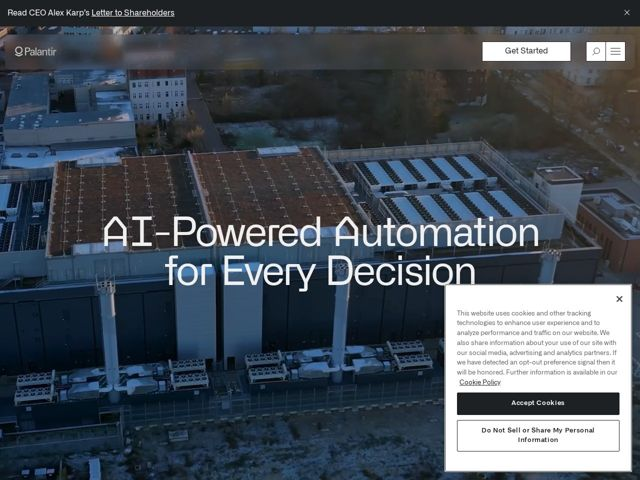

# Palantir — https://palantir.com

- **niche:** data
- **mood:** technical-dark
- **style:** photographic, cinematic, dark, minimal
- **palette:** bg `#1B2A33` · ink `#F2F0EB` · accent `#FFFFFF` — Solid white 'Get Started' pill button top-right; white wordmark, icons, and the off-white serif headline reversed out of the photographic overlay
- **type:** display *Light humanist old-style serif (Palantir custom serif, in the spirit of a soft transitional/Plantin-like face)* · body *Neutral grotesque sans-serif (system/Helvetica-like) for nav, banner, and UI labels* — Quietly literary and institutional — the soft serif reads like a manifesto or a book cover, not a dashboard. Stoic, confident, deliberately un-techy.
- **sections:** promo-banner › hero › cookie-consent
- **signature:** A defense/data-infrastructure company leads with a giant, soft, almost romantic light-weight SERIF headline over a real-world aerial photo of physical infrastructure — rejecting the entire enterprise-SaaS playbook of geometric sans + abstract gradient/mesh graphics. The type feels like the cover of a book, not a product page.
- **imagery:** Full-bleed, edge-to-edge documentary aerial photography of actual built environment (industrial rooftops, solar arrays, a factory/campus) shot from a drone, graded with a cool dark blue-teal overlay for contrast and gravitas. No icons, no 3D product mockups, no illustration — the imagery insists the software acts on the real, physical world.
- **copy:** Sweeping, absolutist manifesto voice — abstract ambition over feature lists. Hero headline (verbatim): "AI-Powered Automation for Every Decision". Top banner: "Read CEO Alex Karp's Letter to Shareholders".

**Takeaways (steal as ideas, don't copy):**
- Pair a giant LIGHT-weight serif at near-poster scale with tight leading and reverse it out of a real photograph — the contrast of literary type over gritty documentary imagery signals seriousness without a single icon.
- Replace abstract tech gradients with true-to-life aerial/drone photography of physical infrastructure to argue your software touches the real world, not just screens.
- Strip the hero to almost nothing: wordmark, one white pill CTA, two icons, one sentence. The restraint itself reads as authority and scale.
- Use a slim top promo banner to surface a thought-leadership artifact (a CEO letter) — positioning the brand as a voice/institution above a vendor.
