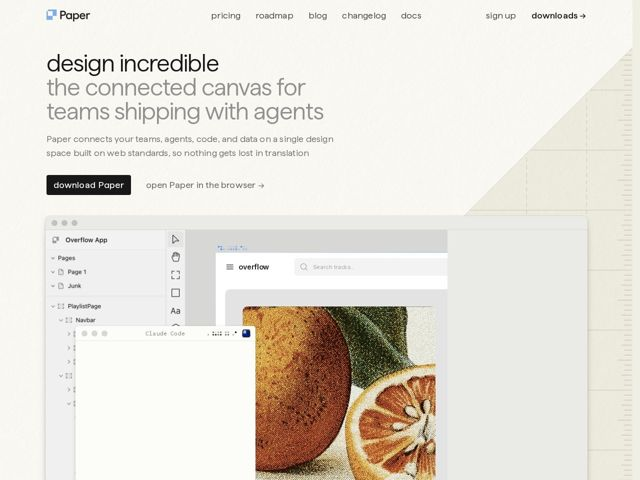

# Paper — https://paper.design

- **niche:** design-tools
- **mood:** editorial-minimal
- **style:** minimal, mono-type, photographic
- **palette:** bg `#F2EFE6` · ink `#1C1B19` · accent `#D9742B` — appears almost nowhere in chrome — saved entirely for the halftone-print orange photograph inside the product canvas; UI is otherwise ink-on-cream with a near-black CTA button
- **type:** display *Inter (single weight, all-lowercase, tight-set at large size)* · body *Inter* — quiet and confident — one neutral grotesque doing everything, lowercase throughout signals approachable craft over corporate polish; the restraint is the statement
- **sections:** hero › feature-desktop-intro › feature-loop-to-code › feature-real-data › feature-handoff › how-it-works › feature-connect-agent › feature-design-and-code › feature-prompt-data › feature-update-content › feature-agents-see-canvas › feature-stay-in-control › roadmap › changelog › blog › footer
- **signature:** The skeuomorphic folded-paper dog-ear in the top-right corner — a peeled page edge revealing faint ruled-notebook lines underneath. A literal paper fold on a digital design tool turns the product name into a physical material metaphor, the exact opposite of the flat dark-mode glassmorphism every canvas/dev tool defaults to.
- **imagery:** Live product UI as hero imagery — a layered design canvas with a nested layers panel ("Overflow App", Pages, Navbar) and floating windows including a "Claude Code" agent frame. The focal asset is a coarse halftone/risograph-printed photograph of a sliced orange, treating a stock image as if run through a print press. The whole composition reads like a designer's working file mid-edit, not a polished marketing render.
- **copy:** Lowercase, lyrical, manifesto-as-feature-list voice; hero reads "design incredible — the connected canvas for teams shipping with agents" with the "anti-slop workflow for humans and agents" thesis running through every heading.

**Takeaways (steal as ideas, don't copy):**
- Reserve color entirely for content, not chrome — a fully neutral cream/ink shell makes one printed photograph the single hero accent, so the product's own output is the visual hook.
- Make the brand metaphor physical: the folded-paper corner with ruled lines turns the name 'Paper' into a tactile detail that no competitor's flat UI can replicate.
- Use a halftone/riso print texture on a photograph to signal 'craft + analog' inside an AI/agent tool — it humanizes an automation pitch ('anti-slop, human touch').
- Write every section heading as a continuous lowercase manifesto ('finally a continuous loop', 'focus on the human touch') so the page reads as one argument, not a feature grid.
