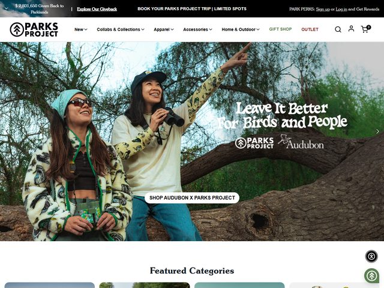

# Parks Project — https://www.parksproject.us

- **niche:** nature
- **mood:** warm-playful
- **style:** photographic, outdoorsy, editorial, lifestyle
- **palette:** bg `#FFFFFF` · ink `#1A1A1A` · accent `#2E7D4F` — Forest green is reserved for the "GIFT SHOP" nav link and the rounded "Give Back" badge bottom-right; everything else stays black-on-white chrome so the green reads as the brand's eco signal, not decoration.
- **type:** display *quirky brush/marker script (think a hand-lettered face like Permanent Marker / Caveat) for the hero headline* · body *clean geometric sans (Proxima Nova / Montserrat) for nav + buttons* — Friendly and outdoorsy; the headline literally looks hand-painted while the UI stays crisp and retail-clean.
- **sections:** hero › featured-categories › collab-story (Audubon) › best-sellers › giveback-impact › lifestyle-editorial › cta › footer
- **signature:** The headline "Leave It Better For Birds and People" is set in a loose, white hand-brushed script overlaid directly on a full-bleed lifestyle photo of two friends birdwatching on a fallen tree — one points up, the other holds binoculars. Below it sits a co-brand lockup (Parks Project × Audubon) and a single rounded white pill button "SHOP AUDUBON X PARKS PROJECT". It's a campaign collab hero, not a product hero: the photo carries the entire mood and the CTA sells a partnership, not a SKU.
- **imagery:** Full-bleed documentary-style lifestyle photography — real people in real apparel (animal-print fleece, beanie, the actual products) in golden afternoon light against green foliage and gnarled bark. No studio, no 3D, no illustration. The product is worn, not displayed.
- **copy:** Warm, mission-first, lowercase-friendly activism. Hero headline: "Leave It Better For Birds and People". Co-brand button: "SHOP AUDUBON X PARKS PROJECT". Top announcement bar stacks mission proof + commerce: "$ 2,801,650 Given Back to Parklands" and "BOOK YOUR PARKS PROJECT TRIP | LIMITED SPOTS".

**Takeaways (steal as ideas, don't copy):**
- Lead with a co-branded collab hero (logo lockup + "SHOP X" button) instead of a product grid — borrows a partner's credibility in the fold.
- Put a live running impact number ("$2,801,650 Given Back") in the announcement bar so the mission is quantified before the user scrolls.
- Set the headline in a genuine hand-brushed script over a documentary photo so the type itself signals "human, outdoors, not corporate."
- Keep the only color accent (green) on the give-back/gift elements so the palette reinforces the eco-mission rather than the sale.
