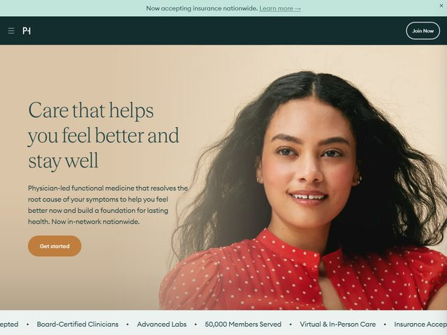

# Parsley Health — https://www.parsleyhealth.com

- **niche:** health
- **mood:** warm-playful
- **style:** photographic, editorial, warm, organic
- **palette:** bg `#E4CBA8` · ink `#1F3A33` · accent `#C8822E` — um bege areia quente preenche o hero; o accent âmbar-queimado aparece só no solitário botão em pílula "Get started" (e ecoa sutilmente o vermelho da blusa da modelo), enquanto o verde-floresta profundo carrega o logo, a headline e a barra de nav do topo.
- **type:** display *editorial serif, Tiempos / Canela style with low-to-medium contrast and humanist warmth* · body *clean neo-grotesque sans, Söhne or Inter, in a soft muted ink* — reconfortante, médico-como-pessoa, autoridade calma em vez de esterilidade clínica.
- **sections:** hero › trust-bar › how-it-works › functional-medicine-explainer › care-team › conditions-treated › member-stories › pricing › cta › footer
- **signature:** O hero é construído sobre um fundo bege-quente sem emendas, full-bleed, com um retrato real e naturalmente iluminado de uma mulher relaxada e sorridente em uma blusa vermelha de poá, o cabelo capturado em meio movimento — lê como um editorial de bem-estar de revista, não um anúncio de telemedicina. A headline serifada fica em verde-floresta profundo diretamente sobre o bege, sem card nem scrim, deixando tipografia e foto compartilharem uma única tela terrosa contínua. Uma faixa de anúncio fina em verde-menta ("Now accepting insurance nationwide") encima tudo, a única nota fria num quadro que de resto é quente.
- **imagery:** Hero fotográfico único — um retrato de estúdio sofisticado com luz direcional suave, cenário raso e um fundo de papel monocromático em tom areia-quente que se funde ao fundo da página, fazendo o sujeito parecer incorporado em vez de recortado. Sem 3D, sem ilustração, sem UI de produto; apenas um rosto humano fazendo todo o trabalho emocional.
- **copy:** Tranquilização calorosa, liderada por benefício, em inglês simples. Headline (serifada): "Care that helps you feel better and stay well". Subtítulo: "Physician-led functional medicine that resolves the root cause of your symptoms to help you feel better now and build a foundation for lasting health. Now in-network nationwide." Faixa de eyebrow: "Now accepting insurance nationwide. Learn more →". Trust bar abaixo: "Board-Certified Clinicians · Advanced Labs · 50,000 Members Served · Virtual & In-Person Care · Insurance Accepted".

**Takeaways (roube como ideias, não copie):**
- Combine a cor do fundo da foto com o fundo da página para que o sujeito fique *dentro* da página em vez de em cima dela — uma única tela quente contínua, sem imagem de hero emoldurada.
- Use uma tinta verde profunda e dessaturada para headlines serifadas sobre um fundo bege quente para parecer um bem-estar editorial calmo, não um SaaS clínico e frio.
- Reserve o único accent saturado (âmbar-queimado) para uma única pílula de CTA, e deixe a cor do figurino do sujeito rimar discretamente com ela.
- Faça flutuar uma barra de anúncio fina em tom frio acima do hero quente para carregar uma mensagem de confiança oportuna ("insurance nationwide") sem perturbar a composição principal.
- Ancore uma faixa de credibilidade com pontos de prova separados por vírgula/ponto ("50,000 Members Served", "Board-Certified Clinicians") logo abaixo da dobra, em vez de uma parede de logos.
