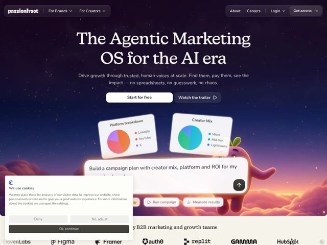

# Passionfroot — https://passionfroot.me

- **niche:** marketing
- **mood:** technical-dark
- **style:** gradient, cinematic, illustrated, dark
- **palette:** bg `#1A1230` · ink `#FAF7F2` · accent `#F0976A` — warm sunset-cloud gradient at the lower third, the orange/coral glow behind the mascot, and pie-chart data slices; CTAs stay neutral white/dark
- **type:** display *serif (high-contrast didone-style, used for the giant hero headline)* · body *Nunito Sans* — warm editorial confidence — an elegant high-contrast serif headline paired with a friendly humanist sans-serif body, feeling more like a lifestyle magazine than a B2B SaaS
- **sections:** hero › logos › feature-product-intro › feature-discovery › feature-outreach › feature-campaigns › feature-payments › feature-tracking › feature-analytics › feature-playbook › problem › testimonials › faq › cta › footer
- **signature:** A 3D claymation-style purple fruit mascot ("Zest") physically perched inside the hero, peeking up from a sunset cloudscape and gesturing at floating glassy product UI cards — injecting Pixar-grade character warmth into a dead-serious B2B GTM/AI category that almost universally defaults to cold grids and abstract gradients.
- **imagery:** Cinematic dreamscape backdrop: a deep indigo starfield up top dissolving into a glowing orange-pink sunset cloudscape at the base. Floating semi-transparent glassmorphic product cards (Platform breakdown, Creator Mix pie charts, a prompt/chat input bar with quick-action chips) drift above the clouds, anchored by a soft-rendered 3D mascot character — the whole composition reads as a single illustrated scene rather than a screenshot dump.
- **copy:** Bold category-claiming positioning in a stately serif, undercut by plain-spoken relief copy. Hero: "The Agentic Marketing OS for the AI era" / sub: "Drive growth through trusted, human voices at scale. Find them, pay them, see the impact — no spreadsheets, no guesswork, no chaos."

**Takeaways (steal as ideas, don't copy):**
- Pair a high-contrast editorial serif headline with a rounded humanist sans body to make AI/B2B feel premium and human instead of techy-cold
- Anthropomorphize the AI agent as a soft-rendered 3D mascot living in the hero scene — gives the product a face and a personality competitors lack
- Build the hero as one continuous illustrated environment (starfield-to-sunset gradient) so floating UI cards feel like they inhabit a world, not pasted on a flat bg
- Frame product UI as small, tilted glassmorphic 'evidence' cards (pie charts, a prompt bar with action chips) to show capability without a heavy dashboard screenshot
