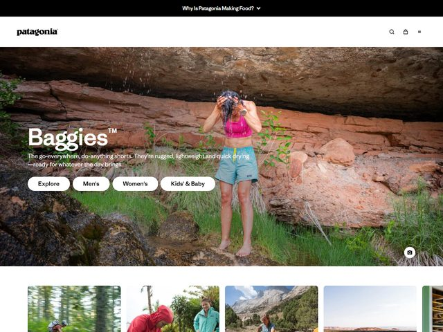

# Patagonia — https://www.patagonia.com

- **niche:** nature
- **mood:** editorial-minimal
- **style:** photographic, full-bleed, editorial, minimal-chrome
- **palette:** bg `#FFFFFF` · ink `#1A1A1A` · accent `#E84B2A` — The orange-red is borrowed straight from the sandstone canyon in the hero photo and from the model's hot-pink tank, not declared in chrome; the UI itself stays monochrome (black wordmark, black icons, white pill buttons). The 'accent' is a property of the photography, so the brand color lives in the world, not in the buttons.
- **type:** display *condensed slab/grotesque headline (House Industries 'Chalet' or a tight Helvetica-condensed), heavy weight, set huge over the photo with a tiny superscript ™* · body *neutral humanist sans (Helvetica Neue / Arial-class), regular, white on photo* — Plain, rugged, no-nonsense; the type acts like a product hangtag stamped onto the scene.
- **sections:** hero › product-category-grid › activity-stories › environmental-callout › worn-wear-resale › cta › footer
- **signature:** A single full-bleed editorial photograph fills the entire fold — a woman in a pink top and Baggies shorts standing barefoot in a creek under a dripping red-rock overhang — and the headline 'Baggies™' plus four flat white pill nav-buttons (Explore / Men's / Women's / Kids' & Baby) are simply laid over the lower-left of the real scene. There is no studio product shot, no gradient, no card: the product is sold by showing it being lived in, in actual wilderness, with the marketing reduced to one word.

- **imagery:** Documentary outdoor photography, full-bleed and uncropped — warm desert-canyon light, real water, real dirt, motion in the dripping spring above her head. The thumbnail strip below the fold continues the same language (mountain-bikers in a blurred forest, a paddler in red, a climber against granite), all candid in-the-field shots rather than catalog stills. Zero illustration, zero 3D.
- **copy:** Terse, gear-spec voice that trusts the photo to do the selling. Eyebrow promo bar reads 'Why Is Patagonia Making Food?'; the hero headline is just the product name 'Baggies™' with the subhead 'The go-everywhere, do-anything shorts. They're rugged, lightweight and quick drying — ready for whatever the day brings.'

**Takeaways (steal as ideas, don't copy):**
- Pull your accent color out of the hero photograph instead of declaring it in chrome — keep every button and icon monochrome so the only color on screen comes from the real scene.
- Let one full-bleed documentary photo BE the entire fold and reduce the headline to a single trademarked product name; the wilderness does the persuading.
- Put your primary navigation as plain white pills directly on top of the photo's lower-left negative space rather than in a separate banded header — it keeps the image uninterrupted.
- Write the subhead as a flat gear-spec sentence ('rugged, lightweight and quick drying') and let the promo bar ask a curiosity question ('Why Is Patagonia Making Food?') to carry brand story above the fold.
