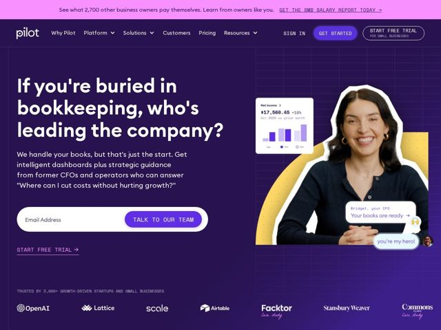

# Pilot — https://pilot.com

- **niche:** fintech
- **mood:** bold-loud
- **style:** bold, colorful, photographic
- **palette:** bg `#3B1E73` · ink `#FFFFFF` · accent `#F5C518` — círculo de meio-tom amarelo-mostarda fazendo um halo em torno do sujeito da foto; o violeta secundário (#8B5CF6) conduz a pílula de CTA principal, os rótulos de eyebrow em monoespaçada e os links de texto sublinhados.
- **type:** display *Heavy geometric grotesque (Helvetica Now / Inter Display weight Bold, single-story 'a', tight tracking)* · body *Humanist grotesque (Inter / Helvetica), regular weight with monospace eyebrows for labels like START FREE TRIAL* — confiante, direto, levemente editorial — grandes frases-pergunta em bold sobre um corpo utilitário e discreto
- **sections:** hero › logos › problem › feature-guidance › how-it-works › cta-lead-magnet › pricing › footer
- **signature:** A colagem conversacional de balões de chat: balões de mensagem falsos de CFO/fundador ("Bridget, your CFO → Your books are ready", "you're my hero!") fixados ao lado de uma foto humana recortada com faca, transformando uma demo de dashboard em um diálogo emocional em vez de uma foto de recurso.
- **imagery:** Fotografia de estúdio recortada (uma CFO real e sorridente, mascarada do fundo) composta sobre cor chapada, emoldurada por um círculo pontilhado de meio-tom mostarda, com chips flutuantes de UI do produto (card de gráfico de lucro líquido, balões de chat "Your books are ready", "you're my hero!") colados ao redor dela — híbrido de screenshot de produto + fotografia, com tratamento de colagem de scrapbook.
- **copy:** Ansiedade-como-headline, interrogação em segunda pessoa. Hero real: "If you're buried in bookkeeping, who's leading the company?" — nomeia a dor do fundador e então a responde com uma CFO humana.

**Takeaways (roube como ideias, não copie):**
- Abra com a pergunta emocional do cliente, não com o substantivo do seu produto — um H1 interrogativo de frase completa ('who's leading the company?') supera uma headline de recurso numa categoria de alta ansiedade.
- Desarme uma demo de produto B2B colando-a como uma thread de mensagens de texto: combine balões de chat reais ('you're my hero!') com uma foto humana recortada com faca para que o software pareça uma relação.
- Use um único accent quente (círculo de meio-tom mostarda) como um holofote contra um fundo frio saturado (roxo profundo) para que um único rosto humano se torne o único ponto focal da tela.
- Envolva rótulos utilitários de eyebrow e CTAs em maiúsculas monoespaçadas para sinalizar 'rigor de fintech' enquanto mantém o copy do hero caloroso e humano.
