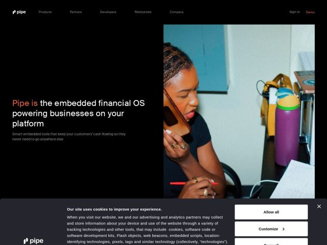

# Pipe — https://pipe.com

- **niche:** fintech
- **mood:** technical-dark
- **style:** dark, photographic, editorial-minimal, mono-type
- **palette:** bg `#0A0A0A` · ink `#FFFFFF` · accent `#FF4D1C` — as primeiras duas palavras da headline do hero ("Pipe is"), o CTA de nav "Demo" e a pequena marca de chama do logo — usado como um ponto esparso de ignição, nunca como preenchimento
- **type:** display *SFMono-Regular (monospaced system font used at large display sizes)* · body *SFMono-Regular (same mono carried into body copy)* — voz de terminal de engenheiro — a monoespaçada por toda parte dá à página inteira uma sensação de editor de código / infra, sinalizando 'somos o OS financeiro, não um banco de consumo'
- **sections:** hero › logos › feature-capital › feature-tools › feature-nocode › feature-speed › products › cta › footer
- **signature:** Compor a página inteira em uma fonte monoespaçada (SFMono) em tamanhos de display — a fintech quase sempre recorre a uma sans humanista calorosa para parecer confiável e acessível; a Pipe, em vez disso, aposta na tipografia de terminal/código para se posicionar como infraestrutura de desenvolvedor (o 'OS financeiro'), e a combina com um único accent laranja-quente de ignição sobre uma tela preto-puro.
- **imagery:** Fotografia documental full-bleed, não retocada, em estilo 35mm — uma pessoa real ao telefone numa mesa bagunçada, leve granulação de filme, cor naturalista (parede verde-petróleo, garrafa magenta). Deliberadamente pouco corporativa e calorosa para contrabalançar a UI fria mono/preta. A foto é recortada em um bloco retangular duro que ocupa a metade direita, sem cantos arredondados nem molduras de dispositivo.
- **copy:** Voz de posicionamento de infraestrutura, B2B2B, que nomeia a categoria abertamente — hero: "Pipe is the embedded financial OS powering businesses on your platform" com o subtítulo "Smart embedded tools that keep your customers' cash flowing so they never need to go anywhere else."

**Takeaways (roube como ideias, não copie):**
- Use uma display monoespaçada para ler instantaneamente como 'plataforma de infra/dev' em vez de fintech de consumo — só a tipografia já faz o posicionamento.
- Destaque apenas as primeiras 2-3 palavras da headline na cor de accent para que o olho pouse no sujeito ('Pipe is') antes da afirmação — um truque de ênfase barato e de alto impacto.
- Combine uma UI fria preto-puro + mono com fotografia documental calorosa e granulada de um humano real para adicionar humanidade sem diluir a marca técnica.
- Reserve um único accent quente (laranja) para exatamente três pontos de contato — logo, palavra destacada, CTA principal — para que funcione como ignição, não decoração.
