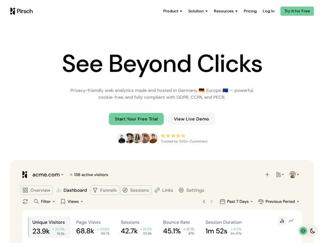

# Pirsch — https://pirsch.io

- **niche:** analytics
- **mood:** clean-light
- **style:** minimal, mono-type, photographic
- **palette:** bg `#FDFBF7` · ink `#1A1A1A` · accent `#A8E063` — Primary CTA button fill (Start Your Free Trial), live-visitor status dot, positive trend deltas in the dashboard
- **type:** display *Poppins (geometric sans, heavy weight)* · body *Poppins (lighter weight)* — Friendly geometric sans with rounded terminals and circular bowls; the ultra-bold display weight feels confident and approachable rather than corporate-serious
- **sections:** hero › feature-setup › feature-insights › feature-details › feature-empower › feature-customize › testimonials › cta › footer
- **signature:** The hero punchline "See Beyond Clicks" is rendered as a single massive black geometric-sans line on a warm off-white canvas with zero illustration or gradient — then immediately undercut by a real, fully-populated product dashboard bleeding up from the bottom in a rounded card. The page sells trust through a literal screenshot of the tool doing its job, not abstract marketing art.
- **imagery:** Two-register imagery: (1) a high-fidelity, true-to-product analytics dashboard mockup (real metric cards, trend arrows, tab chrome, light/dark toggle) used as the hero centerpiece; (2) small rounded avatar stack of real-looking customer faces beside a 5-star rating for social proof. No icons-as-decoration, no abstract 3D — everything pictured is the actual UI.
- **copy:** Punchy 3-word benefit headline that reframes the category ("See Beyond Clicks"), backed by a compliance-flexing subhead — confident, privacy-as-product voice with literal German/EU flag emojis.

**Takeaways (steal as ideas, don't copy):**
- Lead with a 3-word category-reframing headline set in one giant bold line, then let a real product screenshot carry all the proof — no hero illustration needed.
- Warm off-white (#FDFBF7) background instead of pure white plus a single soft lime-green accent reads calmer and more premium than the typical clinical SaaS blue/white.
- Bake credibility cues directly under the CTA: avatar stack + star row + 'Trusted by 500+ Customers' as a tight one-line trust unit.
- Use emoji flags (DE, EU) inline in the subhead to communicate jurisdiction/data-residency instantly — a privacy selling point made visual in one glance.
