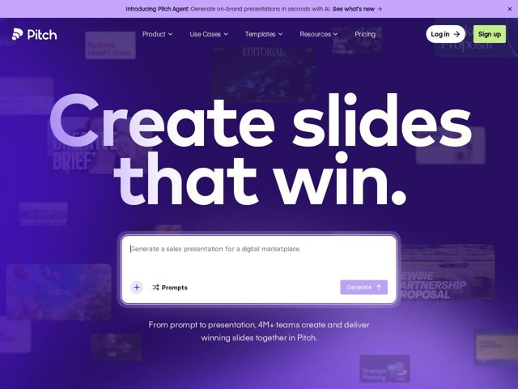

# Pitch — https://pitch.com

- **niche:** productivity
- **mood:** bold-loud
- **style:** gradient, colorful, dark
- **palette:** bg `#4B22C8` · ink `#FFFFFF` · accent `#C6F24E` — Reservado quase exclusivamente ao botão de CTA 'Sign up' no canto superior direito — um único chip verde-limão que salta contra o campo todo roxo; todo o resto (nav, headline, subhead, UI do prompt) permanece branco-sobre-roxo.
- **type:** display *Sans grotesca customizada (a face da marca Pitch) — geométrica, peso muito pesado, tracking apertado, bojos perfeitamente circulares em C/e/a* · body *Mesma família em peso regular/medium* — Bold, arredondada, confiante, grotesca-moderna — peso amigável sem ser brincalhão
- **sections:** hero › feature-workspace › problem › how-it-works › feature-toolkit › feature-integrations › testimonials › templates › cta › footer
- **signature:** Headline branca gigantesca que sangra para além das bordas do viewport, posta sobre uma parede de miniaturas de decks roxas e desfocadas — o próprio output do produto vira o papel de parede, e uma única caixa de prompt de IA branca e nítida abre um buraco na névoa como o único ponto onde o olho pousa.
- **imagery:** Conduzida por screenshots de produto, mas tratada como uma colagem esmaecida: dezenas de miniaturas de decks reais (Editorial, Bloom, Business Model Canvas, Partnership Proposal) desfocadas e com tom roxo, ladrilhadas atrás do hero para que sejam lidas como textura/atmosfera em vez de UI focal. Uma caixa de prompt de IA ao vivo ("Generate a sales presentation for a digital marketplace") fica no centro como o único elemento nítido e branco.
- **copy:** Headline enérgica que promete um resultado. O hero diz "Create slides that win." — curta, começando pelo verbo, com enquadramento de vitória em vendas; a subhead "From prompt to presentation, 4M+ teams create and deliver winning slides together in Pitch." Voz confiante, de resultados-acima-de-recursos.

**Takeaways (roube como ideias, não copie):**
- Construa o fundo do hero a partir do output do seu próprio produto, depois desfoque + aplique um tom monocromático numa única cor da marca para que ele seja lido como textura ambiente, não como UI concorrente.
- Gaste todo o seu orçamento de saturação em UM único elemento: aqui, um CTA limão solitário num mar de roxo. A escassez torna o alvo do clique impossível de ignorar.
- Defina a headline maior do que a zona segura para que as letras toquem as bordas da tela — isso sinaliza confiança e força o olho a completar a palavra.
- Coloque o produto ao vivo (a caixa de prompt de IA) diretamente no hero como o único objeto nítido e de alto contraste, transformando a primeira impressão num momento interativo de experimente-agora em vez de um pitch estático.
