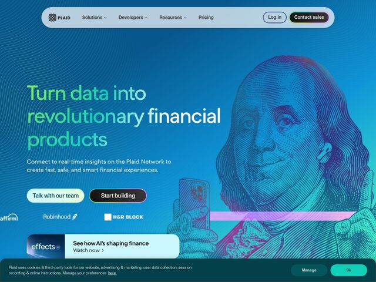

# Plaid — https://plaid.com

- **niche:** fintech
- **mood:** technical-dark
- **style:** gradient, cinematic, dark, colorful
- **palette:** bg `#0a4a8c` · ink `#ffffff` · accent `#7CFFB2` — as palavras da headline do hero 'data' / 'revolutionary' renderizadas em verde-menta, os botões principais e o gradiente magenta-para-ciano que banha a gravura de Ben Franklin
- **type:** display *Bowery Street (display tipo-serifa de alto contraste) combinada com Plaid Sans para a segunda palavra do hero* · body *Plaid Sans* — Editorial e confiante — uma face display alta e apertada mesclando palavras serifadas e sem serifa dentro de uma única headline, dando uma voz autoritária, quase de capa de revista, sobre o corpo de texto em sans engenheirada
- **sections:** hero › feature-ai-video-card › logos › feature-network › feature-ai-infrastructure › feature-network-quality › feature-bank-coverage-stats › showcase › cta › footer
- **signature:** Um retrato fotorrealista do Benjamin Franklin gravado na nota de $100, recolorido num duotone de gradiente magenta-para-ciano intenso e segurando um smartphone — a iconografia do dinheiro literalmente puxada para a era digital, rompendo a convenção fintech usual de 3D-abstrato estéril / screenshot-de-dashboard.
- **imagery:** Gravura de moeda recolorida em duotone (Franklin) como uma ilustração de hero full-bleed, fundida com uma foto de dispositivo real; textura de gravura/guilhochê de linha fina ecoando os padrões de segurança de cédulas; campo de gradiente azul profundo com sutil trabalho de linhas radiais. A imagem é conduzida por metáfora, não por screenshot.
- **copy:** Voz de empoderamento ousada e declarativa que promete transformação — hero: "Turn data into revolutionary financial products"; os subtítulos têm um quê espirituoso ("Want access to 12K banks? We've got the API keys.").

**Takeaways (roube como ideias, não copie):**
- Misture duas famílias tipográficas DENTRO de uma única headline (display serifada + sans) e colora apenas as palavras de verbo/objeto para fazer uma só linha ser lida como arte e mensagem ao mesmo tempo.
- Recolora um artefato real culturalmente carregado (dinheiro, um retrato) num duotone com o gradiente da marca em vez de recorrer aos típicos blobs 3D abstratos de fintech.
- Deixe os títulos de seção H2 carregarem personalidade e humor ('We've got the API keys') em vez de rótulos genéricos de recurso.
- Combine um acento menta saturado contra o azul-oceano profundo para que CTAs e palavras-chave saltem sem um choque de cores agressivo.
