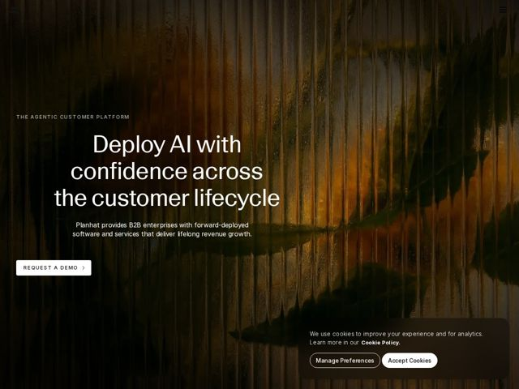

# Planhat — https://planhat.com

- **niche:** crm
- **mood:** premium-luxe
- **style:** dark, cinematic, photographic, editorial-minimal
- **palette:** bg `#1a1308` · ink `#f4f1ea` · accent `#c8761f` — brilho âmbar/pôr-do-sol quente sangrando através da foto de vidro canelado do hero; a única cor saturada numa página de resto quase preta e monocromática
- **type:** display *serifa grande (transicional/estilo Times, ex. uma serifa editorial refinada)* · body *sans-serif grotesca neutra* — literária e segura — uma headline serifada de editora combinada com um corpo sans discreto é lida como confiança institucional, não como correria de startup
- **sections:** hero › problem › feature-platform › how-it-works › feature-services › feature-automation › feature-software › careers › feature-mcp-server › cta
- **signature:** Troca todo o manual de customer-success/CRM (gradientes azuis, dashboards de produto, avatares sorridentes) por uma fotografia cinematográfica de pôr-do-sol-através-de-vidro-canelado + uma headline editorial serifada gigante — a página parece a campanha de uma marca de luxo, não software B2B.
- **imagery:** Fotografia atmosférica e abstrata vista através de vidro texturizado/canelado: uma cena natural quente (sol, água, folhagem) difundida em fitas verticais de vidro, fortemente escurecida. Sem UI de produto, sem pessoas, sem ícones no hero — puro clima e textura.
- **copy:** Voz enterprise calma e autoritária, conduzida por uma promessa em serifa — hero: "Deploy AI with confidence across the customer lifecycle"; o eyebrow a posiciona como "The Agentic Customer Platform."

**Takeaways (roube como ideias, não copie):**
- Use uma única foto de vidro texturizado/refração como hero para que uma única fonte de luz quente se torne toda a sua narrativa de cor contra o quase-preto.
- Combine uma grande headline editorial serifada com um eyebrow e corpo em sans discreto para sinalizar peso institucional, em vez do típico tudo-em-sans de SaaS.
- Mantenha o chrome quase inexistente — eyebrow com letter-spacing, um h1 serifado, uma linha de corpo, um único CTA em pílula ('Request a Demo') — deixando a imagem carregar a página.
- Deixe o acento ser ambiente (luz vazando através da foto) em vez de um botão ou selo, para que a marca seja lida como premium e contida.
