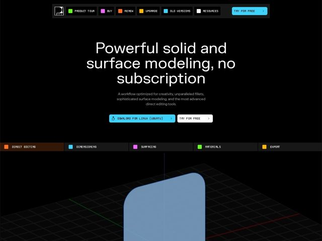

# Plasticity — https://plasticity.xyz

- **niche:** design (3D/CAD modeling software for artists)
- **mood:** technical-dark
- **style:** dark, mono-type, 3d, colorful
- **palette:** bg `#000000` · ink `#FFFFFF` · accent `#3FC7F4` — pílula de CTA principal (Download for Linux), swatch de Old Versions na nav; mas o acento na verdade é um conjunto completo de swatches arco-íris — chips verde/magenta/laranja/amarelo/ciano/branco ao lado de cada rótulo de nav e de aba de recurso
- **type:** display *Sans geométrica humanista (estilo Gilroy/Poppins, terminais arredondados) para o H1* · body *Monospace (estilo JetBrains Mono / Berkeley Mono) para todos os rótulos de UI, nav, botões, chrome de abas* — Barra de ferramentas de engenharia encontra estúdio de artista — rótulos mono clínicos carregando uma headline arredondada e amigável, a sensação literal da própria interface de um app CAD.
- **sections:** nav › hero › feature-tabs › why-plasticity › feature-boolean › feature-surfacing › feature-fillets › feature-dimensions › feature-direct-editing › enterprise › community › no-subscription › pricing › cta-creativity › testimonials › faq › cta-getstarted › footer
- **signature:** Cada item de nav e aba de recurso é prefixado com um pequeno quadradinho de cor sólida — uma legenda literal de paleta de camadas/materiais de CAD embutida no chrome do site. A página de marketing veste a própria UI de barra de ferramentas codificada por cores do app em vez de links de nav genéricos de SaaS.
- **imagery:** Um viewport 3D real e de aparência interativa como a tela do hero: cena preto-puro, grade de chão em perspectiva tênue, gizmo de eixo-mundo RGB (linhas vermelha/verde/azul) e um sólido envernizado azul-claro de cantos arredondados no meio da modelagem. A imagem é a própria superfície do produto — sem ilustração, sem render de marketing, só a ferramenta fazendo o que faz.
- **copy:** Headline de benefício-e-objeção que começa pelo modelo de negócio, não pelo recurso — posicionamento anti-assinatura voltado a criativos cansados. H1 do hero: "Powerful solid and surface modeling, no subscription"

**Takeaways (roube como ideias, não copie):**
- Codifique o domínio do seu produto no chrome: ícones de swatch coloridos ao lado de cada item de nav/aba espelham uma paleta de camadas de CAD, fazendo o site parecer uma extensão do app.
- Coloque 'no subscription' NO H1 — venda a filosofia de preços como o benefício de destaque quando seu público está fatigado pelo modelo rentista dos concorrentes.
- Use um viewport de produto de aparência ao vivo (grade + gizmo de eixo RGB + um modelo real) como hero em vez de uma ilustração de hero; deixe a ferramenta ser seu próprio screenshot.
- Combine rótulos de UI em monospace clínico com uma única headline em sans arredondada e quente para que a página seja lida como 'instrumento de precisão com uma veia criativa humana.'
