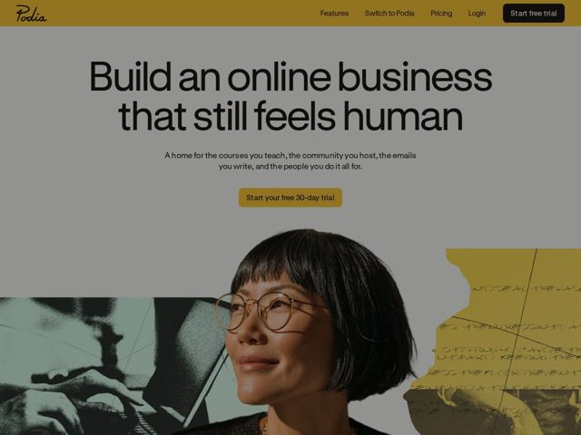

# Podia — https://podia.com

- **niche:** marketing
- **mood:** warm-playful
- **style:** photographic, colorful, editorial
- **palette:** bg `#A48A1E` · ink `#1C1C1A` · accent `#A48A1E` — O mostarda/ocre domina a barra de nav superior e o preenchimento do botão de CTA principal ('Start your free 30-day trial'); ecoado nos tons duotone da colagem. A própria tela do hero é um cinza quente apagado (#9E9C95) para que a headline preto-tinta carregue o contraste.
- **type:** display *Sans neo-grotesca grande (apertada, baixo contraste, próxima de Söhne/GT America) para o h1; mais um wordmark em script desenhado à mão para o logo 'Podia'* · body *Sans-serif humanista (sensação de Inter / grotesca de sistema) com entrelinha generosa* — Sans editorial confiante combinada com uma assinatura manuscrita pessoal — pôster de galeria encontra bilhete escrito à mão
- **sections:** hero › problem › feature-tour › how-it-works › testimonials › feature-grid › cta › footer
- **signature:** A colagem fotográfica de papel rasgado: um retrato recortado em cores plenas sobreposto a fragmentos editoriais em duotone e a um pedaço de carta manuscrita rasgada — uma sensação de álbum de recortes analógico que faz uma ferramenta de SaaS ser lida como quente e humana em vez de polida.
- **imagery:** Colagem conduzida por fotografia: um retrato humano real e com iluminação quente (mulher de óculos) recortado e sobreposto a fragmentos editoriais de foto em duotone (verde-sálvia, mostarda) mais um pedaço rasgado de manuscrito à mão. Grão risográfico/meio-tom nas imagens de apoio; o sujeito do hero em cores plenas. Tratamento de recorte-e-cole de revista, não screenshot de banco de imagens.
- **copy:** Posicionamento anti-tech, pró-humano. Headline do hero (real): "Build an online business that still feels human" — voz quente, tranquilizadora, de criador-para-criador, que nomeia o problema ("The internet is starting to feel less human") antes do pitch.

**Takeaways (roube como ideias, não copie):**
- Comece pelo inimigo, não pelo produto: um h2 como 'The internet is starting to feel less human' enquadra a página inteira como uma postura antes de qualquer recurso aparecer.
- Use um fundo apagado e dessaturado (cinza quente) para que um único acento saturado (mostarda) e o tipo preto-puro façam todo o trabalho de contraste — a contenção é lida como premium-quente.
- Misture mídias deliberadamente: um retrato real em cores plenas + fragmentos de foto em duotone + um pedaço manuscrito rasgado = textura de álbum de recortes que humaniza um produto de software.
- Combine uma face display grotesca limpa com um logo genuinamente em script manuscrito para sinalizar 'feito por pessoas' sem sacrificar a legibilidade.
