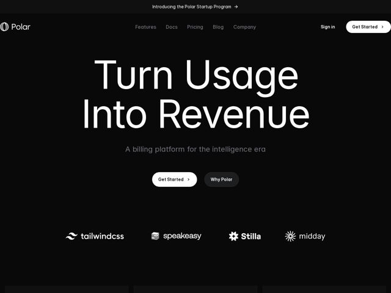

# Polar — https://polar.sh

- **niche:** dev-tools
- **mood:** technical-dark
- **style:** dark, mono-type, minimal, bento
- **palette:** bg `#0A0A0A` · ink `#FFFFFF` · accent `#FFFFFF` — Botão principal invertido em branco (Get Started) contra o quase-preto; o CTA secundário é uma pílula carvão. Não há acento cromático — o próprio contraste é o acento.
- **type:** display *Sans grotesca geométrica (a grotesca customizada/quase-monolinear da Polar, lembrando uma Helvetica/Neue Haas apertada)* · body *Mesma sans grotesca em peso mais leve, cinza apagado para a subhead* — Engenheirada, confiante, com contenção quase brutalista — headline gigante com sensação de caixa-baixa e tracking apertado que é lida mais como sinalização industrial do que como copy de marketing de SaaS típico.
- **sections:** announcement-bar › hero › logos › feature-pricing-models › feature-revenue-dashboard › feature-built-for-ai › testimonials › pricing › cta › footer
- **signature:** Uma headline de hero colossal de duas linhas que quase sangra de borda a borda (display type a ~200px, fazendo o logo e a nav parecerem minúsculos) — a página começa com tipografia monumental como a imagem do hero, recusando a convenção de dev-tool de um screenshot de produto ou animação de terminal acima da dobra.
- **imagery:** Sem fotografia e sem screenshot no hero. A linguagem visual é tipografia pura mais logos de parceiros monocromáticos (tailwindcss, speakeasy, Stilla, midday) renderizados em branco chapado. Abaixo da dobra, muda para um grid bento de cards de produto escuros. Tudo é em escala de cinza — a profundidade vem da sutil elevação entre painéis #0A0A0A, não da cor.
- **copy:** Voz de desenvolvedor enérgica, declarativa, com o resultado em primeiro lugar — o hero diz "Turn Usage Into Revenue" com a subhead "A billing platform for the intelligence era"; títulos secundários como "Any pricing model. Ships in an afternoon." vendem velocidade e posicionamento AI-native.

**Takeaways (roube como ideias, não copie):**
- Faça da headline o hero: defina o display type tão grande que ele atravesse o viewport e pule totalmente o screenshot de produto acima da dobra — deixe as palavras carregarem o peso.
- Vá totalmente monocromático e deixe o contraste figura/fundo fazer o trabalho de uma cor de acento — inverta um CTA para branco sólido contra o quase-preto para que a ação principal salte sem nenhum matiz.
- Combine uma afirmação monumental ('Turn Usage Into Revenue') com uma subhead cinza pequena e silenciosamente confiante ('billing platform for the intelligence era') — o salto de escala é toda a jogada retórica.
- Ancore o posicionamento ao momento: 'Built for the shape of AI' / 'intelligence era' enquadra uma ferramenta de cobrança como infraestrutura AI-native em vez de mais um SaaS de pagamentos.
