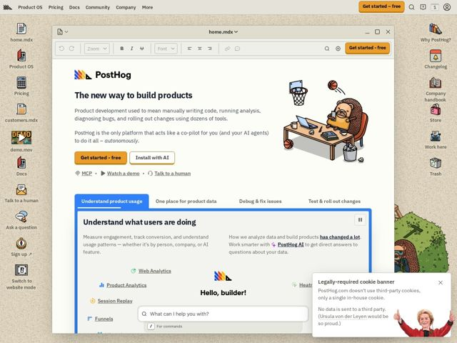

# Posthog — https://posthog.com

- **niche:** analytics
- **mood:** warm-playful
- **style:** illustrated, colorful, photographic
- **palette:** bg `#EEEAE2` · ink `#1D1F27` · accent `#F1A82C` — botões de CTA principal (Get started - free), o botão Get started da barra de ferramentas inferior, o sublinhado de aba ativa e pequenos destaques inline; o fundo bege-quente do desktop é, ele próprio, uma cor secundária da marca
- **type:** display *Open Runde (sans geométrica arredondada para o H1/títulos); uma serifa (Charter / Computer Modern) usada para o corpo de texto da janela de sistema operacional* · body *IBM Plex Sans Variable para o chrome da UI, com Source Code Pro para código e Comic Sans MS / Fairytale como fontes-piada deliberadas* — brincalhão, de cantos macios, anticorporativo; a sans display arredondada sinaliza simpatia enquanto a serifa retrô-OS e as fontes-gag adicionam personalidade irreverente
- **sections:** hero › feature-product-usage › logos › feature-data-stack › pricing › feature-ai › problem › blog › cta › footer
- **signature:** A página inteira é encenada como um falso sistema operacional de desktop: um papel de parede bege com ícones skeuomórficos de arquivo/app em ambas as laterais (home.mdx, Pricing, Docs, Trash, customers.mdx) emoldurando uma janela de documento .mdx arrastável com uma barra de ferramentas de editor de texto funcional. O site de marketing literalmente faz cosplay do produto.
- **imagery:** Ilustração flat desenhada à mão como linguagem dominante - um mascote ouriço de óculos relaxando numa mesa, ícones skeuomórficos de app de OS e arte de ponto peculiar - mesclados com uma peça de fotografia de meme (uma pessoa real recortada acenando ao lado do banner de cookies). Sem screenshots de produto no hero; o próprio chrome é o visual do produto. O tratamento é quente, esboçado, em tons terrosos de baixa saturação com o acento laranja saltando contra o bege.
- **copy:** Voz de fundador direta, confiante, levemente atrevida, que nomeia a dor antes do produto - o H1 do hero diz "The new way to build products" com a subcopy "PostHog is the only platform that acts like a co-pilot for you (and your AI agents) to do it all - autonomously."; os rótulos de seção entram na piada ("Bedtime reading", "Shameless CTA", um "Legally-required cookie banner" com uma gozação interna).

**Takeaways (roube como ideias, não copie):**
- Encene a página inteira como a interface do seu produto: embrulhe a copy de marketing numa janela de app real e skeuomórfica (barra de ferramentas, barra de título, chrome arrastável) para que os visitantes sintam o produto antes de clicar em qualquer coisa.
- Use ícones de app de desktop-OS como sua nav/sidebar - transforme links de menu chatos (Pricing, Docs, Changelog, Trash) em ícones ilustrados e rotulados ao longo das laterais da página para calor e navegabilidade imediatos.
- Nomeie seções com piadas em vez de rótulos de categoria ('Bedtime reading' para o blog, 'Shameless CTA' para o fechamento) para telegrafar uma voz de marca não corporativa na própria hierarquia de títulos.
- Implante fontes deliberadamente 'erradas' como recurso de personalidade - misturar uma sans arredondada, uma serifa old-school e até Comic Sans sinaliza confiança e irreverência em vez de desleixo.
