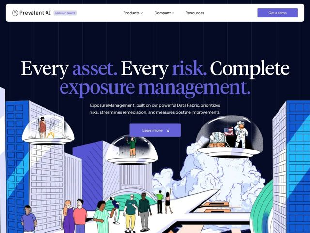

# Prevalent — https://prevalent.ai

- **niche:** security
- **mood:** bold-loud
- **style:** illustrated, colorful, dark
- **palette:** bg `#141433` · ink `#FFFFFF` · accent `#4C3FE6` — Hero word 'asset'/'risk', the 'Get a demo' CTA button, the 'Learn more' button, and cyan-teal flourishes in the illustration
- **type:** display *Tiempos Headline (high-contrast serif)* · body *Matter (geometric grotesque sans)* — Editorial serif gravitas colliding with clean modern sans — confident, premium, almost literary for a security tool
- **sections:** hero › problem › feature-data-fabric › feature-exposure-management › testimonials › resources › cta › footer
- **signature:** A hand-drawn, surreal cityscape illustration as the hero backdrop — people standing in glowing UFO-like glass domes above a city, a NASA astronaut planting a flag, rocket exhaust clouds — turning a dry cybersecurity exposure-management pitch into a whimsical sci-fi editorial scene. Security sites are almost universally cold/abstract/grid-y; this goes fully narrative-illustrated.
- **imagery:** Custom flat-vector editorial illustration in a bold limited palette (indigo, royal blue, cyan-teal, cream). Surreal sci-fi vignette: a stylized city skyline, diverse crowds of people, transparent observation domes, an astronaut, billowing rocket clouds. Thick confident linework, no photography, no UI screenshots in the hero.
- **copy:** Punchy, almost-poetic declaratives that name the pain then promise totality — hero reads "Every asset. Every risk. Complete exposure management." with the problem section landing "Limited visibility. Too much noise. Always playing catch up. It's time to take back control."

**Takeaways (steal as ideas, don't copy):**
- Use a huge high-contrast serif headline with color-highlighted keywords ('asset', 'risk' in accent indigo) to make a 3-clause statement scan like a manifesto
- Replace the cold security-niche aesthetic with a full-bleed narrative illustration in a tight 4-color palette to feel human and memorable
- Pair an editorial serif display (Tiempos) with a neutral geometric sans (Matter) — gravitas up top, legibility in body
- Structure copy as staccato fragments — name three pains in three short sentences, then pivot to a control/empowerment promise
