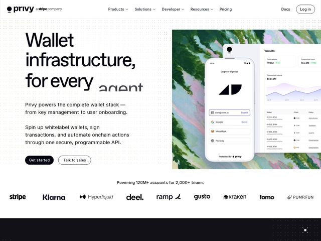

# Privy — https://privy.io

- **niche:** crypto-infra / dev-tools (wallet infrastructure API)
- **mood:** clean-light
- **style:** minimal, mono-type, photographic
- **palette:** bg `#FFFFFF` · ink `#111111` · accent `#8FB89A` — textura suave de pintura a óleo em sálvia/lavanda dentro do painel do mockup de produto; de resto a página é quase monocromática com uma pílula de CTA preto-puro
- **type:** display *Sans-serif grotesca, peso quase-preto, tracking muito apertado (estilo Helvetica/Neue Haas)* · body *Mesma família neo-grotesca em peso regular* — Confiante, densa, editorial de headline gigante — tipo suíço utilitário fazendo o trabalho pesado em vez de cor ou decoração
- **sections:** hero › logos › feature-crypto-rails › feature-key-management › feature-embedded-wallets › feature-onboarding › feature-integrations › feature-security › how-it-works › cta › newsletter › footer
- **signature:** Uma textura pictórica e suavemente desfocada de pintura a óleo/aquarela (pinceladas verde-sálvia e lilás) usada como pano de fundo dentro do screenshot de UI do produto — um gradiente orgânico e pintado à mão onde todo concorrente de crypto/dev-tool recorre a brilhos neon escuros, grids ou vidro 3D. Calor como diferenciação numa categoria fria-tech.
- **imagery:** Screenshots nítidos de UI de produto em modo claro (modal de login, dashboard de carteira, tabelas de transação) flutuando sobre uma tela pictórica em tons pastel. Um grão pontilhado/meio-tom tênue sangra a partir das margens da página. Logos de parceiros renderizados em preto chapado. Sem ícones-como-decoração — a interface real é a imagem do hero.
- **copy:** Ostentação de infraestrutura declarativa e gigante com um toque de IA — o hero literalmente diz "Wallet infrastructure, for every agent" (a palavra rotativa pousa em "agent"), subhead: "Privy powers the complete wallet stack — from key management to user onboarding."

**Takeaways (roube como ideias, não copie):**
- Substitua a obrigatória estética crypto neon-escura por uma textura pastel pintada à mão atrás de uma UI branca e limpa — calor e memorabilidade instantâneos numa categoria fria.
- Deixe uma única headline grotesca gigante e de tracking apertado carregar todo o hero; gaste zero em cor para que o tipo e o mockup pictórico façam todo o trabalho.
- Use uma última palavra rotativa no H1 ('for every ___ → agent') para fazer um pitch de infraestrutura estático parecer atual e dinâmico.
- Empilhe uma forte linha de prova social ('Powering 120M+ accounts for 2,000+ teams') diretamente acima de uma parede de logos em preto chapado logo abaixo da dobra para credibilidade imediata.
