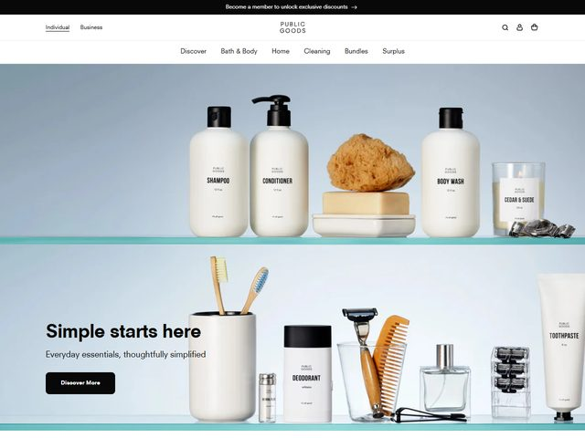

# Public Goods — https://www.publicgoods.com

- **niche:** nature
- **mood:** clean-light
- **style:** minimal, photographic, editorial, product-forward
- **palette:** bg `#D7E3E0` · ink `#1A1A1A` · accent `#0E0E0E` — Não há, na prática, acento cromático: a única "cor" é o suave gradiente azul-petróleo das prateleiras encenadas e o bege quente de uma esponja-do-mar natural. A ênfase é carregada por um wordmark preto chapado, headline preta e um botão sólido preto em pílula "Discover More".
- **type:** display *sans neo-grotesca, família Helvetica Now / Aktiv Grotesk, peso bold, apertada* · body *mesma grotesca, regular, cinza* — Simples, sem firulas, com confiança de varejo; o wordmark "PUBLIC GOODS" é em caixa-alta com letter-spacing amplo, uma voz discreta de rótulo de farmácia.
- **sections:** hero › category-grid (bath-body / home / cleaning) › membership-pitch › sustainability-story › bestsellers › bundles › cta › footer
- **signature:** O hero é construído como duas "prateleiras de vidro" horizontais com um leve brilho azul-petróleo por baixo, e toda a família de produtos é alinhada nelas como uma vitrine de farmácia de verdade — shampoo, condicionador, sabonete líquido, uma vela, e abaixo um copo de escovas de dente, desodorante, lâmina, pente, perfume, pasta de dente. A borda direita cortada (tubo de pasta de dente metade fora do quadro) sinaliza "a linha continua", transformando uma parede plana de produtos numa prateleira navegável que você escaneia da esquerda para a direita.
- **imagery:** Natureza-morta fotográfica de produto, com iluminação de estúdio sobre fundos pastel frios. Cada frasco veste o mesmo rótulo creme minimalista com tipo em versalete, de modo que a linha é lida como um sistema coeso; a esponja natural solitária e o pente de madeira injetam textura orgânica contra a uniformidade de resto clínica de plástico-branco.
- **copy:** Calma, declarativa, com quase zero adjetivos de marketing — headline "Simple starts here", subhead "Everyday essentials, thoughtfully simplified", barra promocional no topo "Become a member to unlock exclusive discounts," CTA "Discover More."

**Takeaways (roube como ideias, não copie):**
- Encene uma linha inteira de produtos numa "prateleira" literal para que o próprio catálogo se torne o hero — a amplitude comunica valor melhor do que uma única foto bonita.
- Corte o produto mais à direita pela metade, fora do quadro, para implicar que a linha continua e convidar ao scroll horizontal.
- Unifique uma linha diversa com um sistema de rótulo idêntico (papel creme, nome em versalete) para que a consistência visual faça o trabalho de confiança da marca.
- Abandone totalmente a cor de acento: deixe um conjunto pastel suave + tipo preto-puro + CTA preto em pílula serem lidos como minimalismo premium, não como um encarte de descontos.
