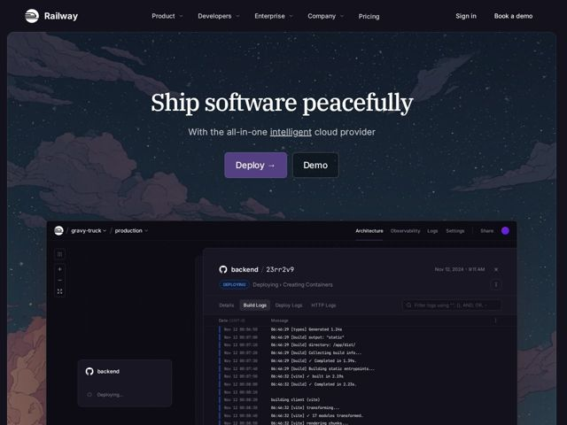

# Railway — https://railway.app

- **niche:** devops
- **mood:** technical-dark
- **style:** dark, gradient, photographic
- **palette:** bg `#13141C` · ink `#FFFFFF` · accent `#7B5BD6` — Preenchimento do CTA principal 'Deploy →', a palavra-link sublinhada inline ('intelligent') na subhead, o ponto de status ao vivo no chrome do dashboard e as pílulas de estado 'DEPLOYING' dentro do screenshot do produto
- **type:** display *IBM Plex Serif* · body *Inter / Inter Tight* — Headline serifada de calma editorial sobre corpo em grotesca neutra e limpa, com JetBrains Mono para texto de log/console — artesão-encontra-engenheiro
- **sections:** hero › logos › problem › feature-deploy › feature-networking › feature-scaling › feature-observability › feature-workflow › cta › footer
- **signature:** Uma headline de hero serifada ("Ship software peacefully") posta gigante sobre uma cena pintada de céu noturno — usando uma serifa literária para uma ferramenta de DevOps a fim de fazer infraestrutura crua parecer calma e humana, e logo em seguida respaldando-a com um console de produto hiper-realista.
- **imagery:** Conduzida por screenshot de produto: um dashboard de deployment escuro e fiel ao pixel (logs de build ao vivo, canvas de arquitetura, pílulas de status) flutua para dentro do hero, cortado pela metade na dobra de modo que seja lido como um console real em execução. O pano de fundo é um céu noturno pintado à mão com campo de estrelas e nuvens — ilustrativo, não malha-de-gradiente — dando ao dashboard uma calma de "zarpar à noite".
- **copy:** Registro calmo, quase espiritual, para infra: o hero diz "Ship software peacefully" — vende alívio emocional, não recursos. A subhead nomeia o produto de forma direta ("the all-in-one intelligent cloud provider"); os H3s de seção apoiam-se na mesma voz de tranquilidade-pelo-ofício ("without the complexity", "without the growing pains").

**Takeaways (roube como ideias, não copie):**
- Combine uma headline serifada literária (IBM Plex Serif) com um corpo grotesco (Inter) e uma mono (JetBrains Mono) para texto in-product/de log — três vozes que mapeiam para marca / UI / máquina.
- Substitua o hero padrão de malha-de-gradiente por um céu noturno ilustrado e pintado à mão; ele dá ao 'technical-dark' um calor e uma atmosfera que um gradiente CSS não consegue.
- Corte um console de produto real e preenchido na dobra para que ele sangre para fora da tela — implica um sistema ao vivo em vez de um mock de marketing polido.
- Reserve um único acento violeta para um CTA, uma palavra-link inline e os pontos de status-ao-vivo apenas — deixe o fundo azul-marinho escuro carregar todo o resto.
