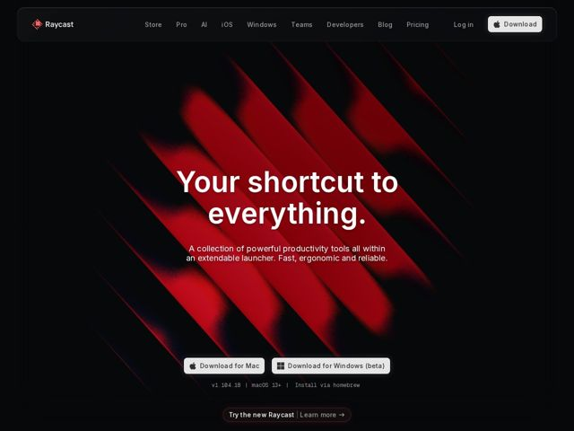

# Raycast — https://raycast.com

- **niche:** productivity
- **mood:** bold-loud
- **style:** dark, gradient, minimal
- **palette:** bg `#0A0A0B` · ink `#FFFFFF` · accent `#E5172F` — Um único feixe de gradiente diagonal vermelho-para-preto cortando a hero que é, fora isso, quase totalmente preta; também tinge o logo, a borda do pill secundário 'Try the new Raycast' e os estados ativos dos links. Todo o resto permanece monocromático para que o vermelho seja lido como energia, não decoração.
- **type:** display *Inter (tracking apertado, peso pesado) — grotesca geométrica com espaçamento entre letras quase zero no H1* · body *Inter em peso regular; monoespaçada (SF Mono / mono do sistema) para a linha de metadados de versão 'v1.104.18 | macOS 13+ | Install via homebrew'* — Confiante, com precisão de engenharia, baixa ornamentação. Sans grande e bold para o impacto emocional, monoespaçada como uma piscadela de 'somos uma ferramenta de dev'.
- **sections:** hero › feature-philosophy › feature-extensions › feature-ai › feature-pro › feature-snippets › feature-stay-in-loop › cta › footer
- **signature:** Um único 'feixe' de gradiente vermelho diagonal e afiado cortando uma hero puramente preta — como um laser/raycast que literaliza o nome do produto — em vez do habitual brilho borrado e centralizado. A luz tem direção e arestas, não é um blob radial suave.
- **imagery:** Gradient-mesh como atmosfera da hero (feixe vermelho direcional sobre preto), e então screenshots de UI do produto mostrando a paleta do launcher em cada seção de feature. Tratamento: capturas do app em modo escuro de alto contraste flutuando sobre o canvas preto com brilho sutil, deixando a própria UI nítida do produto carregar a credibilidade — sem fotos de banco, sem 3D, sem pessoas.
- **copy:** Aspiracional-minimalista: uma promessa de 4 palavras que vende resultado em vez de feature. O H1 da hero diz 'Your shortcut to everything.' com subtítulo 'A collection of powerful productivity tools all within an extendable launcher. Fast, ergonomic and reliable.' Os títulos de seção falam como um colega confiante ('It's not about saving time.', 'Don't repeat yourself.', 'Take the short way.')."

**Takeaways (roube como ideias, não copie):**
- Dê um nome à sua fonte de luz: faça o gradiente da hero literalizar o nome do produto (um feixe 'raycast') para que o brilho abstrato ganhe seu lugar em vez de ser ambientação genérica.
- Mono-como-metadado: solte uma linha monoespaçada sob o CTA (versão, requisito de OS, comando de instalação) — sinaliza instantaneamente uma ferramenta de dev confiável e recompensa o visitante técnico sem um screenshot.
- Contenção como volume: mantenha 99% da página em preto e branco e gaste sua ÚNICA cor saturada numa única forma. O acento é lido como bold justamente porque nada mais compete.
- Escreva títulos de seção como opiniões, não rótulos ('It's not about saving time' vence 'Features') — a página defende uma visão de mundo, que é muito mais remixável que uma grade de features.
