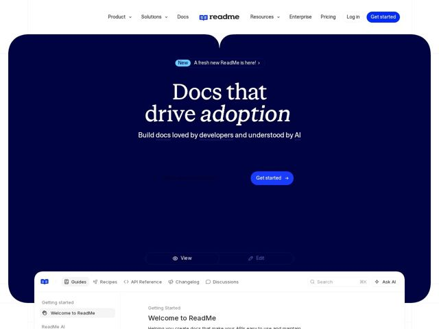

# Readme — https://readme.com

- **niche:** dev-tools (API documentation platform)
- **mood:** technical-dark
- **style:** dark, gradient, mono-type
- **palette:** bg `#0A0F4D` · ink `#FFFFFF` · accent `#2D4BFF` — Botões CTA 'Get started' (pill), links de palavras-chave sublinhados no subtítulo (docs/developers/AI), o pill do badge 'New' e o wordmark/logo de livro do readme
- **type:** display *Serifada transicional de alto contraste (estilo Tiempos/Canela) com um itálico verdadeiro para a palavra de ênfase* · body *Sans-serif geométrica/grotesca (estilo Inter) para nav, subtítulo e chrome de UI* — Voz de título editorial-literária colidindo com uma sans de engenharia limpa — autoridade livresca encontra ferramental pronto para produção
- **sections:** nav › hero › logos › feature-product-preview › docs-ui-embed
- **signature:** Uma UI de documentação ao vivo e interativa (abas Guides / Recipes / API Reference, sidebar, Ask AI) está colada pela metade sobre a borda inferior da hero como uma gigante 'janela de produto' em card arredondado — a página literalmente se torna o produto, sangrando o chrome real do app para dentro do fold de marketing em vez de mostrar um screenshot plano.
- **imagery:** Sem fotografia ou ilustração. A linguagem visual é o próprio produto: uma interface de documentação real, de cantos arredondados, renderizada como uma janela superdimensionada sem dispositivo, com abas de toggle View/Edit e uma sidebar de pseudo-IDE. Um canvas azul-marinho profundo com um brilho radial suave atrás do título faz todo o trabalho atmosférico; o realismo da UI substitui a arte de banco.
- **copy:** One-liner editorial, guiado por resultado, que ressignifica docs como alavanca de crescimento — a hero diz 'Docs that drive adoption' com 'adoption' em serifada itálica, subtítulo 'Build docs loved by developers and understood by AI'.

**Takeaways (roube como ideias, não copie):**
- Coloque a única palavra mais importante ('adoption') numa serifada itálica contrastante enquanto o resto permanece romano — transforma um título numa declaração de tese sem trocar de fonte.
- Sublinhe inline apenas os substantivos que sustentam o sentido no subtítulo (docs, developers, AI) na cor de acento, para que a proposta de valor seja lida como três palavras-chave, não uma frase.
- Sangre a UI real do produto sobre a borda inferior curva da hero como uma única janela enorme arredondada — deixe o fold de marketing e o screenshot do app serem o mesmo objeto.
- Combine um título em serifada literária de alto contraste com uma sans de engenharia simples para todo o resto, sinalizando 'docs são artesanato, a ferramenta é precisa.'
