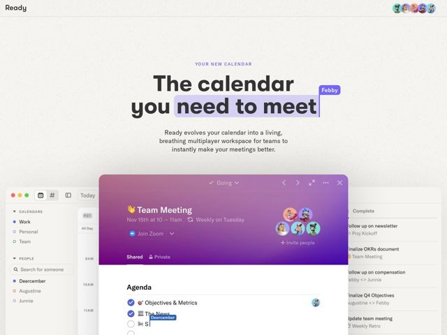

# Ready — https://ready.so

- **niche:** productivity
- **mood:** clean-light
- **style:** minimal, gradient, photographic
- **palette:** bg `#F2F0EC` · ink `#1C1C1E` · accent `#7B6CF6` — destaque de seleção de texto atrás de 'need to meet', a etiqueta flutuante de colaborador 'Febby', o rótulo eyebrow e o chrome roxo-gradiente da janela do app
- **type:** display *Grotesca geométrica bold (peso pesado, tracking apertado) — provavelmente uma família custom/Söhne-Inter* · body *Sans-serif humanista, peso regular* — Título confiante e superdimensionado que parece um pôster; o corpo é quieto e amigável, deixando a imagem do produto e as pistas lúdicas de colaboração carregarem a energia
- **sections:** hero › feature-superpowered-event › feature-meeting-upgrade › feature-leave-ready › feature-joy-to-use › how-it-works › cta › footer
- **signature:** A hero trata a própria página como um documento multiplayer ao vivo: um destaque de seleção de texto cobre as palavras do título 'need to meet' com uma etiqueta de nome de colaborador flutuante ('Febby'), e uma segunda etiqueta de cursor ('Deercember') aparece dentro da UI do produto abaixo — a copy de marketing está literalmente sendo co-editada na sua frente.
- **imagery:** Um grande screenshot do app real em perspectiva inclinada como peça central da hero — uma janela de calendário realista no estilo macOS com um painel de evento em gradiente brilhante roxo-para-rosa, avatares reais, checkboxes de agenda e uma sidebar de tarefas. Textura suave de papel/ruído no fundo off-white; cursores de colaboração ao vivo simulados e chips de seleção sobrepostos para borrar a linha entre site e produto.
- **copy:** Direta, benefício em primeiro lugar, com uma piscadela ('It's time.', 'Get Ready') — título da hero: 'The calendar you need to meet'.

**Takeaways (roube como ideias, não copie):**
- Renderize artefatos de colaboração ao vivo (destaques de seleção de texto, cursores de nome flutuantes) diretamente sobre a copy de marketing para *mostrar* o multiplayer em vez de afirmá-lo
- Combine um título display pesado em escala de pôster com um minúsculo eyebrow em maiúsculas e um subtítulo quieto de 3 linhas para que um único screenshot do produto possa dominar o fold
- Use um canvas off-white com textura quente de papel para fazer uma única janela de app em gradiente saturado roxo-rosa saltar como o único elemento alto
- Título de duplo sentido com trocadilho ('calendar you need to meet') mais CTAs que pagam o nome da marca ('Get Ready') para fazer um produto utilitário parecer charmoso
