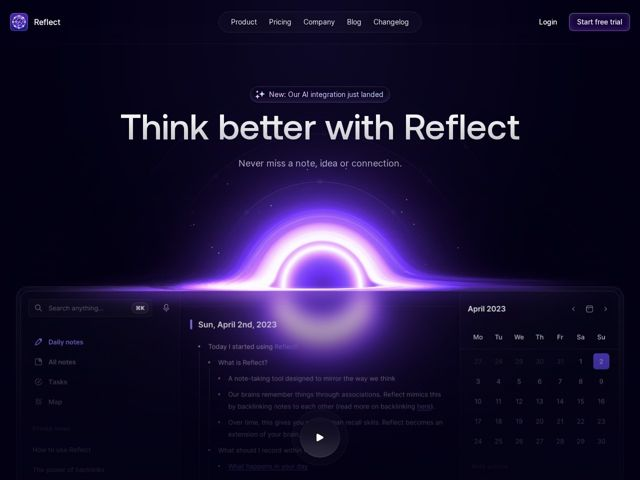

# Reflect — https://reflect.app

- **niche:** productivity
- **mood:** technical-dark
- **style:** dark, gradient, glass
- **palette:** bg `#0B0A1A` · ink `#EDEAF7` · accent `#7C5CFF` — Botões CTA primários (Start free trial), o brilho violeta radiante de buraco-negro na hero, estados ativos de seleção na sidebar/calendário, sublinhados de links inline e o pill de anúncio 'New AI'
- **type:** display *Aeonik Pro* · body *Inter (Inter V variable)* — Display em grotesca geométrica com calor humanista; o título grande, em tamanho óptico, definido em peso light/regular é lido como calmo e premium, não gritado. O corpo em Inter mantém a UI legível e neutra.
- **sections:** hero › feature-ai-assistant › feature-superpowers › feature-never-lose-info › feature › feature-security › feature-meetings › logos › testimonials › team › feature-academy › pricing › cta › footer
- **signature:** Um gradiente violeta brilhante de buraco-negro / horizonte de eventos fica bem no centro sob o título, e o screenshot da UI do produto surge diretamente da sua luz — o brilho cósmico fisicamente sangra para dentro da janela do app, de modo que a ferramenta parece estar emergindo de uma singularidade do pensamento.
- **imagery:** Guiada por screenshot do produto, fundida com uma fonte de luz abstrata em gradient-mesh. A UI real de anotações do Reflect (sidebar, outline de nota diária, calendário) é mostrada num tema escuro e com cores combinadas para que o florescer violeta da hero pareça iluminá-la por baixo. Uma sobreposição de botão de play convida a um vídeo de demo. Pontos de partículas/campo estelar e um leve arco orbital reforçam a metáfora espacial.
- **copy:** Voz aspiracional, resultado em primeiro lugar — vende o benefício cognitivo, não a lista de features. Título da hero: "Think better with Reflect" com subtítulo "Never miss a note, idea or connection."

**Takeaways (roube como ideias, não copie):**
- Tipografia display gigante em peso light/regular sobre quase-preto é lida como mais premium que um bold pesado — deixe o tamanho, não o peso, carregar o título.
- Faça o brilho da hero e o screenshot do produto compartilharem uma cor para que a UI pareça iluminada pela luz da marca; o screenshot emergindo do gradiente é todo o truque.
- Envolva a nav num único pill arredondado flutuante e ecoe esse formato de pill no badge de anúncio e no CTA para um sistema de retângulos arredondados apertado e consistente.
- Comece cada seção com um título de benefício-como-promessa ('Give your brain superpowers', 'Never lose information') em vez de nomear a feature — deixe o screenshot nomear a feature.
