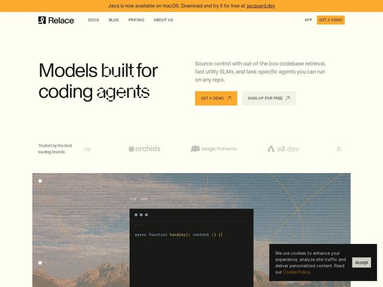

# Relace — https://relace.ai

- **niche:** dev-tools (AI infrastructure / models for coding agents)
- **mood:** editorial-minimal
- **style:** editorial-minimal, photographic, mono-type, warm
- **palette:** bg `#FDF9EC` · ink `#1A1A1A` · accent `#F5A623` — top announcement bar, primary CTA buttons, logo mark, code-syntax highlights, and the thin topographic contour lines overlaid on the hero photo
- **type:** display *High-contrast serif (Didone/transitional, e.g. PT Serif or similar) — note the mix where some glyphs swap to a sans, creating a deliberate hybrid wordmark feel* · body *Neutral grotesque sans-serif (Helvetica/Inter-like)* — Editorial and confident — a literary serif headline grounding a hard technical product, intentionally blending serif and sans letterforms within single words for a 'remixed type' signature
- **sections:** announcement-bar › hero › logos › feature-overview › feature-slms › feature-source-control › feature-reliability-scale › testimonials › faq › cta › footer
- **signature:** Dev-tools pages default to dark terminals and neon-on-black; this one runs on a warm cream paper background and drops a wide landscape PHOTO (a mountain range, with 'FIG. 002' label and topographic contour lines) behind the product code window — treating an AI-infra product like a printed editorial spread rather than a console.
- **imagery:** Photographic + diagrammatic hybrid: a desaturated mountain/landscape photo sits behind a dark macOS-style code editor window. Thin orange topographic contour lines and dot-node annotations ('FIG. 002', corner dots) overlay it like a field-notes plate. Real code is shown (async function handler) with syntax-colored tokens, anchoring the abstract product in concrete output.
- **copy:** Plain-spoken, capability-first technical voice with a literary headline — hero reads "Models built for coding agents" over "Source control with out-of-the-box codebase retrieval, fast utility SLMs, and task-specific agents you can run on any repo."

**Takeaways (steal as ideas, don't copy):**
- Invert the dev-tools palette: warm cream paper + black serif + single orange accent reads premium and editorial where competitors look like terminals.
- Mix serif and sans letterforms within the same headline word to create a memorable, ownable 'hybrid' wordmark instead of a flat font choice.
- Frame the product screenshot as a documented specimen — landscape photo backdrop, 'FIG. 002' plate label, topographic contour overlays — so a code window feels like an editorial figure.
- Pair two CTAs by weight: a filled accent 'Get a Demo' next to a neutral outlined 'Sign up for free', each with a small arrow glyph, to guide without shouting.
