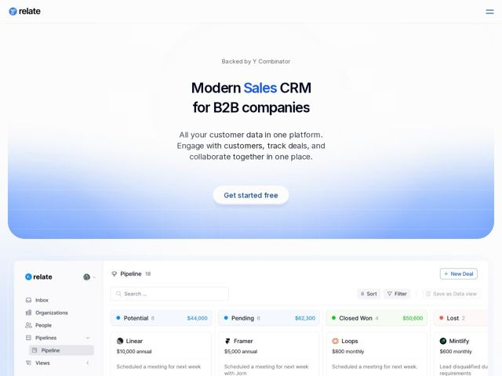

# Relate — https://relate.so

- **niche:** crm
- **mood:** clean-light
- **style:** minimal, gradient
- **palette:** bg `#FFFFFF` · ink `#1A1A2E` · accent `#2D6BFF` — única palavra destacada no título da hero ('Sales'), o glifo do logo do produto, o painel de gradiente céu azul-para-branco atrás da hero e os pontos de status do pipeline ao vivo/cifras em dólar na UI do app embutida
- **type:** display *Inter (ou grotesca geométrica quase idêntica)* · body *Inter* — Sans calma, moderno-utilitária com tracking apertado e peso médio; lê-se como texto de UI de produto em vez de tipografia de display de marketing — deliberadamente discreta e confiável
- **sections:** hero › feature-product-ui › feature-prospect › feature-close › feature-retain › feature-recycle › feature-grid › cta › footer
- **signature:** A hero se dissolve diretamente num gigante screenshot fiel ao pixel do produto real (um pipeline de vendas completo com logos de concorrentes de nomes reais — Linear, Framer, Loops, Mintlify — como deals fictícios). A página de marketing É o app; quase não há camada de abstração entre o pitch e o produto.
- **imagery:** Screenshots de produto de alta fidelidade apresentados como o visual primário da hero, não como decoração. Cards de deal estilo Kanban com favicons de marca, valores em dólar e pills de status. Um painel de gradiente céu ciano-para-branco suave emoldura o texto da hero como um horizonte aberto, e então a UI nítida e branca do app se assenta por cima — atmosfera acima, precisão abaixo.
- **copy:** Título de proposta de valor direto com uma palavra sinalizada por cor; a voz é confiante e B2B-literal. Hero: "Modern Sales CRM for B2B companies."

**Takeaways (roube como ideias, não copie):**
- Sinalize por cor uma ÚNICA palavra num título que de resto é todo em ink (o 'Sales' azul) em vez de estilizar a linha inteira — ênfase barata e de alto contraste que aponta o olho exatamente para onde você quer.
- Use um painel de gradiente céu suave (ciano desbotando para branco) como um palco atmosférico do qual a UI branca de arestas duras do produto emerge — combina 'aspiração' com 'precisão' numa só viewport.
- Popule os screenshots de demo do produto com nomes de marca REAIS e reconhecíveis como deals de exemplo (Linear, Framer, Loops) — credibilidade instantânea e sinalização de 'empresas como você' sem um muro de logos.
- Estruture as seções de feature como um ciclo de verbos (Prospect / Close / Retain / Recycle) para que os próprios títulos narrem o ciclo de vida do cliente que o produto gerencia.
