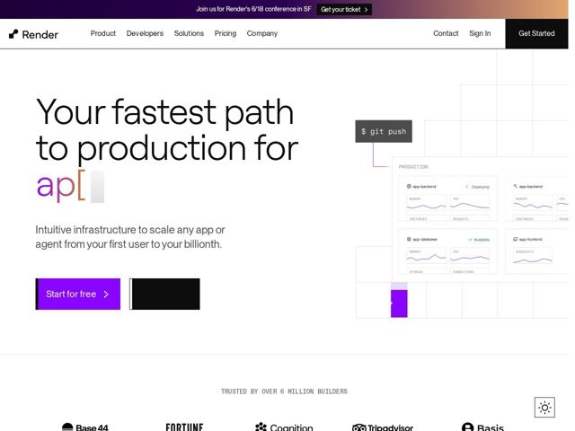

# Render — https://render.com

- **niche:** dev-tools / cloud-infra (PaaS)
- **mood:** clean-light
- **style:** minimal, mono-type, bento
- **palette:** bg `#FFFFFF` · ink `#1A1A1A` · accent `#7C3AED` — primary CTA fill (Start for free), the animated 'api' typing caret in the headline, dashboard sparkline graphs, and the gradient sunrise band in the top conference announcement bar
- **type:** display *Large humanist grotesque sans (Render's geometric-humanist brand sans, similar to a tightened Söhne/Inter), set in a very large light/regular weight for the H1* · body *Same family at regular weight; UI labels and code chrome in a monospace ('$ git push', 'PRODUCTION', 'MEMORY', 'TRUSTED BY OVER 6 MILLION BUILDERS')* — Calm, oversized, and engineer-trustworthy — soft proportional sans for human-facing copy paired with all-caps mono for machine/infra labels, so the page literally speaks two languages
- **sections:** announcement-bar › hero › logos › how-it-works › feature-intuitive-infra › feature-security › feature-grid › cta › footer
- **signature:** The H1 ends in a live-typing animation: 'production for ap|' with a blinking caret and a monospace bracket, where the final word (api/app/agent) is being typed in accent purple as if into a terminal — the headline itself becomes a `git push` demo instead of a static slogan.
- **imagery:** No photography. The hero is a faux product surface: a faint dotted/wireframe grid that real dashboard cards (app-backend, app-database, app-frontend with MEMORY/CPU/INSTANCES tiles and purple sparklines) appear to deploy onto, wired up to a floating '$ git push' terminal chip. Status pills ('Deploying', 'Available') sell the live-infra feeling. Everything is the actual UI rendered as illustration.
- **copy:** Confident, plain-spoken, builder-to-builder — names the outcome not the tech. Hero: 'Your fastest path to production for [api/app/agent]'; subhead 'Intuitive infrastructure to scale any app or agent from your first user to your billionth.'

**Takeaways (steal as ideas, don't copy):**
- Make the headline interactive: end a static H1 with a terminal-style typing caret that cycles the last word in your accent color — turns a tagline into a live demo of what the product does.
- Two-typeface caste system: humanist sans for human copy, all-caps monospace strictly for machine/infra labels (PRODUCTION, MEMORY, TRUSTED BY 6M BUILDERS) — instantly reads 'made by engineers' without going dark-mode.
- Render your own dashboard UI as the hero illustration on a faint wireframe grid, connected to a floating CLI chip ('$ git push'), so the hero IS the deploy flow rather than a decorative screenshot.
- Stay light-mode in a dark-mode-default category: white canvas + single violet accent feels approachable and breaks the 'serious infra = black terminal' convention.
