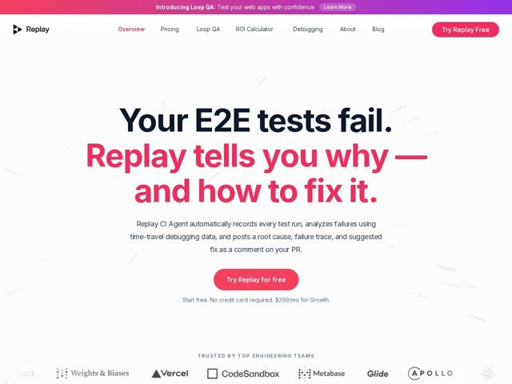

# Replay — https://replay.io

- **niche:** dev-tools
- **mood:** clean-light
- **style:** minimal, mono-type, colorful
- **palette:** bg `#FFFFFF` · ink `#1B2030` · accent `#F23A6B` — second line of the hero headline (the payoff clause), the primary CTA pill, top announcement-bar gradient, active nav item, and faint hand-drawn spark streaks scattered across the canvas
- **type:** display *Heavy geometric rounded grotesque (Poppins/Fredoka-like, very bold with rounded terminals)* · body *Humanist sans-serif (Inter/system-UI-like), regular weight, generous line-height* — Loud, friendly and confident up top; calm, technical and trustworthy in the body — a deliberate two-register contrast
- **sections:** announcement-bar › nav › hero › logos › problem › how-it-works › feature-analysis › testimonials › case-study › feature-debugging › comparison › feature-ci-integration › faq › cta › footer
- **signature:** The hero headline is a two-voice mini-narrative: a flat black statement of the problem ("Your E2E tests fail.") immediately answered by an oversized hot-pink promise ("Replay tells you why — and how to fix it."). The accent color isn't decoration — it IS the resolution of the sentence, so the brand color carries the argument instead of just branding it.
- **imagery:** Almost no photography or product chrome above the fold — the hero is pure type on white. Visual texture comes from faint, hand-drawn pink "spark/motion" line streaks scattered diagonally across the whitespace, evoking energy and motion (a replay/scrubbing metaphor) without a product screenshot. Logo wall uses monochrome client marks fading at the edges for a soft, in-motion ribbon feel.
- **copy:** Problem-then-payoff in plain engineer language, quietly cocky; hero: "Your E2E tests fail. Replay tells you why — and how to fix it."

**Takeaways (steal as ideas, don't copy):**
- Split a single headline into two type registers — flat ink for the pain, supersized accent for the fix — so color does the persuading, not just the styling.
- Skip the obligatory dev-tool product screenshot above the fold; carry energy with sparse hand-drawn motion streaks on white and let bold type own the hero.
- Use named-engineer proof as section headlines ('solved a bug that stumped Dan Abramov') to turn social proof into a story beat rather than a logo grid.
- Pair a friendly rounded display face with a neutral humanist body to signal 'approachable but serious infrastructure' — warmth up top, precision in the details.
