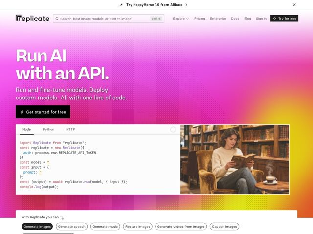

# Replicate — https://replicate.com

- **niche:** ai
- **mood:** bold-loud
- **style:** gradient, colorful, mono-type
- **palette:** bg `#E6299A` · ink `#FFFFFF` · accent `#F5A623` — a hero é uma única lavagem de gradiente full-bleed magenta-para-âmbar; o âmbar/laranja de acento floresce no canto inferior direito e ao redor do painel de código
- **type:** display *Inkwell / um display slab-serif condensado (slab pesado, com ink-traps)* · body *monoespaçada (mono estilo terminal para corpo e código)* — Desafiadoramente anti-Vale-do-Silício: um display slab-serif robusto de tipografia de impressor combinado com corpo todo em mono lê-se como um zine ou um espécime tipográfico vintage, não um template SaaS de sans limpa
- **sections:** hero › feature-code-snippet › feature-use-cases › logos › how-it-works › feature-run-models › feature-fine-tune › feature-deploy › feature-scale › cta › footer
- **signature:** Toda a hero é um único gradiente saturado magenta-para-âmbar SEM espaço em branco, SEM render 3D de produto, SEM orbes de gradient-mesh — e o título é definido num pesado slab-serif de impressor sobre código mono, o polo oposto da estética de sans-limpa azul-frio que toda startup de infra de IA adota por padrão.
- **imagery:** Um editor de código ao vivo com abas (Node/Python/HTTP) fica como o artefato literal da hero — o produto É o código. Ao lado dele, uma incongruente imagem fotográfica quente (uma pessoa lendo numa poltrona de couro, café fumegante, biblioteca) humaniza a página que de resto é dominada pelo terminal. Uma textura sutil de pontos halftone sobrepõe o gradiente.
- **copy:** Direta, voltada ao desenvolvedor, com quase zero enrolação de marketing: "Run AI with an API." — a proposta de valor é o pitch inteiro, declarada como um fato.

**Takeaways (roube como ideias, não copie):**
- Comprometa-se com UM campo de gradiente ousado de borda a borda (magenta->âmbar) em vez do branco seguro + acento minúsculo — deixe a cor ser a marca, não um botão
- Combine um display slab-serif pesado com corpo todo monoespaçado para sinalizar 'para engenheiros' enquanto ainda parece artesanal, não corporativo
- Faça do snippet de código funcional o objeto da hero, com abas de linguagem ao vivo (Node/Python/HTTP) — mostre o produto em vez de descrevê-lo
- Solte uma única fotografia quente e humana num layout que de resto é de máquina/terminal para quebrar a esterilidade e adicionar personalidade
