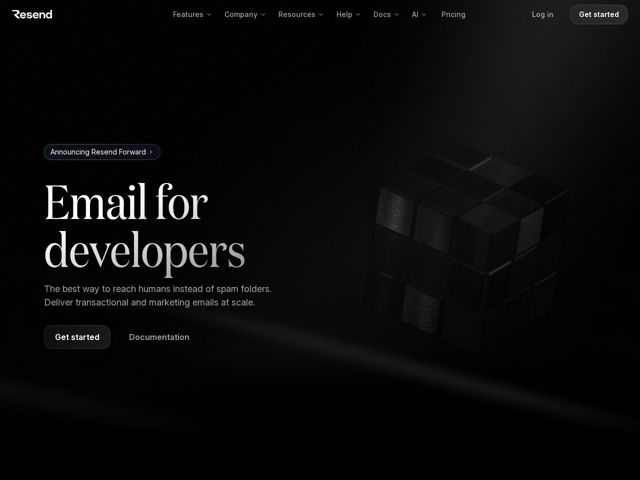

# Resend — https://resend.com

- **niche:** dev-tools
- **mood:** premium-luxe
- **style:** dark, minimal, 3d
- **palette:** bg `#0A0A0A` · ink `#FAFAFA` · accent `#FFFFFF` — There is no chromatic accent — 'accent' is pure white, reserved almost entirely for the solid white 'Get started' pill button (top-right and hero) and the brightest top edge of the serif headline. Everything else is greyscale; emphasis comes from luminance, not hue.
- **type:** display *High-contrast transitional serif (Times/Tiempos-like — thin hairlines, sharp bracketed serifs), used only for the oversized H1* · body *Helvetica (per facts) — neutral grotesque for nav, subhead, buttons, UI* — Editorial-luxe meets engineering-neutral: a couture serif headline grounded by clinical Helvetica everywhere else
- **sections:** hero › feature-integrate › feature-developer-experience › feature-test-mode › feature-webhooks › feature-editor › feature-editor-advanced › feature-contact-management › feature-analytics › feature-react-email › feature-template-demo › problem-deliverability › feature-control › testimonials › cta › footer
- **signature:** A massive high-contrast editorial serif headline ("Email for developers") sitting in near-total black — luxury-magazine typography colliding with a dev tool, where the headline's lower half fades to grey as if dissolving into the dark.
- **imagery:** Abstract-3d: a matte, near-black rendered cube cluster (Rubik's-style fragmented blocks) floating in the right half, lit by a single faint rim light. Tone-on-tone — the object barely separates from the bg, plus one low diagonal light streak raking across the lower hero. Photoreal render, not illustration; almost monochromatic.
- **copy:** Two-word ambition + plainspoken benefit. Hero headline (verbatim): "Email for developers" — subhead "The best way to reach humans instead of spam folders. Deliver transactional and marketing emails at scale." Voice: confident, terse, dev-to-dev, zero hype.

**Takeaways (steal as ideas, don't copy):**
- Build the entire page in greyscale and let one solid-white element (the CTA pill) be the ONLY 'color' — restraint reads as premium in dark dev-tool contexts.
- Pair a single oversized editorial serif headline with otherwise-neutral Helvetica body; the serif/grotesque contrast does all the personality work without a logo-soup or gradients.
- Let the hero 3D object be nearly the same value as the background (tone-on-tone matte black, one rim light) so it reads as texture/atmosphere rather than a hard graphic — quiet luxury over flashy gradient-mesh.
- Use a small rounded 'Announcing X' pill above the headline as a low-key changelog/news hook instead of a banner — keeps the hero clean while still surfacing what's new.
