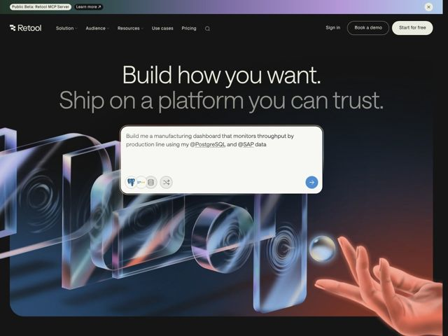

# Retool — https://retool.com

- **niche:** dev-tools
- **mood:** technical-dark
- **style:** dark, 3d, gradient, cinematic
- **palette:** bg `#0A0A0C` · ink `#F2EFEA` · accent `#3B7DF0` — botão CTA de seta-de-envio no campo de prompt, menções inline de fontes de dados @PostgreSQL/@SAP e a lavagem de gradiente quente-para-frio sangrando através do render 3D
- **type:** display *Söhne / grotesca sans (peso apertado, quase condensado)* · body *Söhne (grotesca humanista)* — Engenhada e confiante — a grotesca de baixo contraste superdimensionada com tracking bem apertado lê-se como um título de manifesto, não uma tagline de marketing; a segunda linha caindo para um cinza abafado faz parecer um pensamento digitado se completando
- **sections:** hero › feature-ai-safety › feature-ship-today › feature-team-workflows › logos-trust › testimonials › feature-enterprise › how-it-works › blog-resources › cta › footer
- **signature:** A hero centraliza um campo de prompt de IA ao vivo e editável ("Build me a manufacturing dashboard... using my @PostgreSQL and @SAP data") como a demo literal do produto DENTRO da hero — substituindo a convenção de dev-tool de um screenshot estático de dashboard/código por uma superfície de chat interativa na qual o visitante quer digitar.
- **imagery:** Render 3D cinematográfico: uma fileira de lajes de vidro fosco translúcido / elementos de lente de câmera com refração iridescente nas bordas, flutuando sobre um gradiente escuro que muda de azul-frio para âmbar-quente, com uma mão humana fotorrealista alcançando um orbe de vidro à direita. Renderiza "confiança + artesanato + tangibilidade" em vez de UI literal do produto.
- **copy:** Manifesto em dois tempos no imperativo presente, voz de builder para builder — hero: "Build how you want. Ship on a platform you can trust." (a segunda cláusula em cinza para uma cadência de preparação/resolução).

**Takeaways (roube como ideias, não copie):**
- Divida o título em dois níveis de cor (linha 1 em ink brilhante, linha 2 em cinza abafado) para que uma única frase entregue preparação-depois-resolução sem layout extra.
- Faça da hero um artefato funcional: coloque o input real do produto (um campo de prompt de IA com fontes de dados em @-mention e um botão de envio) bem no centro em vez de um screenshot.
- Combine vidro 3D iridescente abstrato com uma única mão humana fotorrealista para sinalizar 'poderoso mas humano/seguro' — fazendo a ponte na tensão hype-de-IA/confiança em que este nicho vive.
- Rode um gradiente quente-para-frio sob um canvas quase preto para que a página seja lida como escura e premium, porém nunca plana ou fria.
