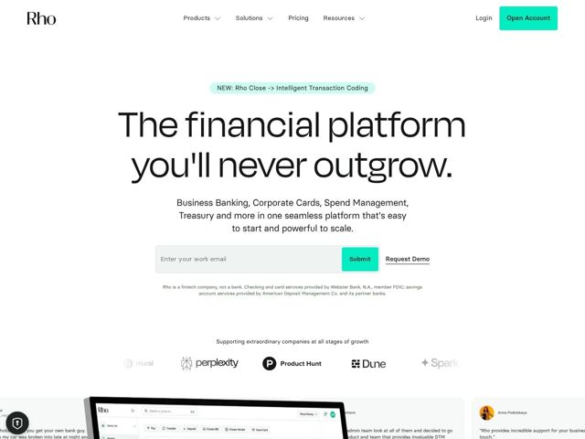

# Rho — https://rho.co

- **niche:** fintech
- **mood:** clean-light
- **style:** minimal, mono-type, photographic
- **palette:** bg `#FFFFFF` · ink `#1A1A1A` · accent `#19E69C` — botão CTA primário (Open Account / Submit), o tom de fundo do pill de anúncio NEW e pequenos destaques na UI do produto
- **type:** display *Reckless / serifada-grotesca de alto contraste (display transicional)* · body *Sans neue-grotesque (classe Aktiv/Helvetica)* — Confiante e editorial — o título display superdimensionado de baixo contraste lê-se mais como uma capa de revista do que um app bancário, conferindo gravidade adulta sem ser empolado
- **sections:** hero › logos › feature-why-teams-choose › feature-one-platform › how-it-works-up-and-running › feature-intelligent-finance › testimonials › cta › footer
- **signature:** A hero abre com um título massivo, centralizado, em escala quase de pôster no estilo wordmark (tipografia display ocupando toda a coluna a ~130px) sobre um campo branco austero — sites bancários quase sempre abrem com um screenshot de dashboard ou uma grade densa de proposta de valor; a Rho, em vez disso, trata o próprio título como a imagem da hero e deixa o espaço em branco fazer a venda.
- **imagery:** Screenshots reais da UI do produto do dashboard da Rho, levemente angulados/cortados e sangrando pela borda inferior da viewport para que a interface seja lida como uma espiada em vez de uma foto plana de hero. Combinados com um muro de depoimentos de fundadores em avatares redondos (headshots reais) e logos de clientes em escala de cinza (Perplexity, Product Hunt, Dune, Spark). O tratamento é leve, arejado, focado no produto — UI em cor real contra o branco, logos dessaturados.
- **copy:** Promessa aspiracional à prova de superação em prosa simples e confiante — hero: "The financial platform you'll never outgrow." com subtítulo ressignificando a abrangência como simplicidade ("easy to start and powerful to scale").

**Takeaways (roube como ideias, não copie):**
- Faça do título a hero: defina a tipografia display em escala de pôster (~120-130px), centralizada no branco, e pule o screenshot de dashboard obrigatório acima do fold — deixe a tipografia carregar a marca.
- Um único acento de alta saturação (mint #19E69C) usado com contenção extrema — apenas o CTA e um pill de anúncio — para que o verde seja lido como 'a cor da ação' contra uma página que de resto é escala de cinza.
- Combine o campo de captura de e-mail diretamente com um link secundário mais suave ('Request Demo') e uma linha de microcopy de compliance logo abaixo, convertendo tanto compradores PLG self-serve quanto guiados por vendas num só bloco.
- Ancore um produto bancário na confiança humana cobrindo a parte inferior da página com headshots reais de fundadores + depoimentos nomeados em vez de ícones abstratos de feature.
