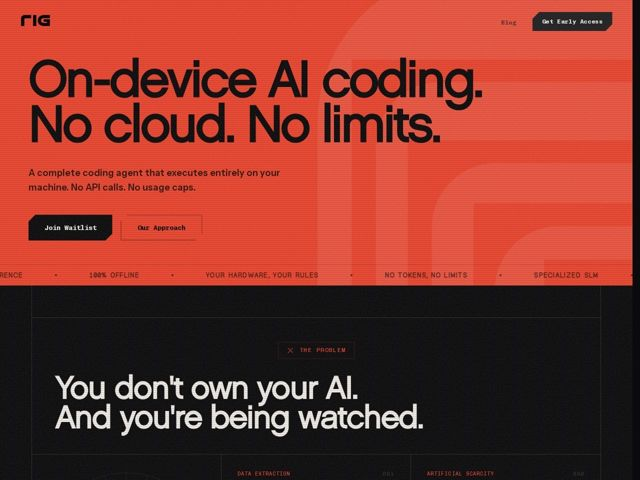

# Rig — https://rig.ai

- **niche:** dev-tools
- **mood:** bold-loud
- **style:** brutalist, mono-type, colorful
- **palette:** bg `#FF3B21` · ink `#0D0D0D` · accent `#FF3B21` — O acento É o fundo do hero — uma inundação vermelho-alaranjada saturada preenche toda a primeira dobra; abaixo da dobra ele inverte para um quase-preto (#141414) com o mesmo vermelho usado em rótulos mono minúsculos, contornos de botão com recorte de ticket e as tags de seção prefixadas com X como 'X THE PROBLEM'
- **type:** display *Chivo Mono (peso heavy/black, usado em tamanhos display enormes)* · body *Chivo Mono (peso regular para parágrafos e rótulos em caixa-alta com tracking aberto)* — Uma única família monoespaçada fazendo tudo — nível terminal, engenheirada, anti-marketing; o peso black lê como uma grotesca encorpada enquanto as small caps leem como um editor de código
- **sections:** hero › logos › problem › feature-everything-local › feature-work-offline › feature-purpose-beats-scale › feature-machine-unleashed › feature-built-for-control-freaks › cta-waitlist › faq › cta › footer
- **signature:** Uma dobra que vira a ideologia com cor: o hero é um manifesto 'on-device' agressivamente todo-vermelho, e então a página desce para uma dobra 'problem' preta com tema de vigilância ('You don't own your AI. And you're being watched.') — a inversão de vermelho-para-preto é a narrativa, não apenas uma quebra de seção. Os botões têm formato de ticket recortado com um canto chanfrado, reforçando o motivo de hardware/terminal.
- **imagery:** Quase nenhuma fotografia ou screenshot de produto na dobra — a imagética é tipográfica e estrutural. Um gigantesco wordmark 'RIG' fantasmagórico sangra fracamente atrás do hero (vermelho tom-sobre-tom), um letreiro/ticker horizontal de afirmações mono em caixa-alta ('100% OFFLINE', 'YOUR HARDWARE, YOUR RULES', 'NO TOKENS, NO LIMITS') separa as dobras, e os blocos de feature são numerados (001, 002) como folhas de spec. O tratamento é chapado, de bordas duras, zero gradientes ou suavidade arredondada.
- **copy:** Voz de manifesto de privacidade confrontadora que nomeia um inimigo ('big AI') — o hero diz 'On-device AI coding. No cloud. No limits.' com o sub 'A complete coding agent that executes entirely on your machine. No API calls. No usage caps.'; os títulos de seção são acusatórios e curtos ('They train on your code.', 'They meter your ambition.', 'Built for control freaks').

**Takeaways (roube como ideias, não copie):**
- Use UMA família monoespaçada em toda a página (Chivo Mono aqui) — peso black para headlines de outdoor, caixa-alta regular com tracking aberto para rótulos — para que a própria tipografia sinalize 'feito por engenheiros' sem nenhuma fonte decorativa
- Faça a mudança de cor carregar a história: inunde o hero com um único acento quente, depois corte de forma dura para quase-preto na dobra 'problem' para que a inversão dramatize o argumento de liberdade-versus-vigilância
- Recorte seus CTAs: chanfre um canto de cada botão num formato de ticket/badge e contorne-os com um traço de acento de 1px para uma sensação de spec de hardware em vez de uma pílula arredondada suave
- Enquadre as features como uma folha de spec numerada (001 / 002...) com tags estilo terminal ('X THE PROBLEM') para fazer uma ferramenta dev parecer documentação em vez de uma página de vendas
