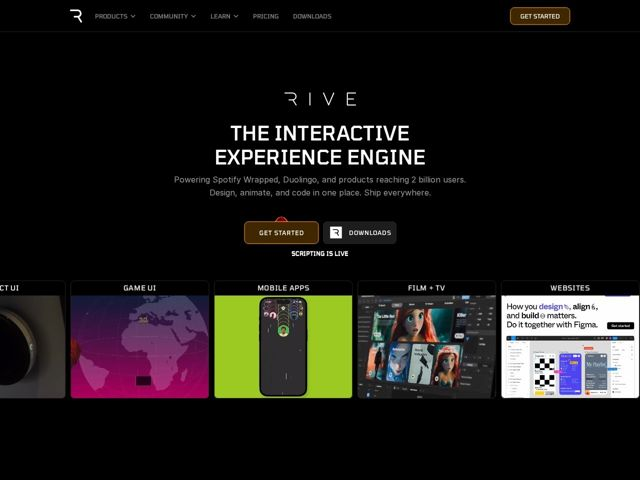

# Rive — https://rive.app

- **niche:** dev-tools / design (interactive animation engine for designers + engineers)
- **mood:** technical-dark
- **style:** dark, mono-type, bento, cinematic
- **palette:** bg `#0A0A0B` · ink `#FFFFFF` · accent `#A35E1E` — primary CTA button fill (bronze/amber gradient), 'GET STARTED' nav pill border, and the logotype's stylized letterforms; otherwise the page is near-monochrome black
- **type:** display *Industrial / techno geometric sans with stencil-cut strokes (condensed all-caps, e.g. a custom or Eurostile/Bank-Gothic-adjacent face)* · body *Neutral humanist sans (Inter/Helvetica-like) at modest weight, muted grey* — Engineered, sci-fi precision — wide-tracked uppercase headlines feel like a spec sheet or a HUD, contrasted with calm, readable grey body copy
- **sections:** hero › feature-design-code-animate › feature-build-once-ship-anywhere › logos-reach-2billion › newsletter-cta › footer
- **signature:** The hero stage is fenced by a horizontal filmstrip of live, looping Rive animations — each tile labeled by use-case (GAME UI, MOBILE APPS, FILM + TV, WEBSITES) in its own vivid color world (magenta globe, acid-green phone, cinematic film grid). The product literally demos itself as the page furniture, instead of a static screenshot.
- **imagery:** Edge-to-edge bento row of self-running product animations rendered in-engine, each card a different saturated palette against the black canvas; a tiny floating red playhead/cursor accent ('SCRIPTING IS LIVE') hints at motion. Imagery IS the product output — no stock photos, no abstract gradients, just real interactive artifacts framed like a showreel.
- **copy:** Bold category-defining claim backed by household-name proof. Hero h1: "THE INTERACTIVE EXPERIENCE ENGINE"; subhead "Powering Spotify Wrapped, Duolingo, and products reaching 2 billion users. Design, animate, and code in one place. Ship everywhere."

**Takeaways (steal as ideas, don't copy):**
- Let the product be the decoration: ring the hero with a labeled row of LIVE looping demos instead of one hero screenshot — proof-of-capability replaces a feature list.
- Borrow credibility numerically and by name: '2 billion users' + Spotify Wrapped/Duolingo in the subhead does more trust-building than a logo wall.
- Go near-monochrome and spend your one accent (bronze/amber) only on the primary CTA so it reads instantly against pure black.
- Use a wide-tracked, stencil-cut techno display face in all-caps to signal 'engine/tooling', then pair with calm grey humanist body for legibility contrast.
