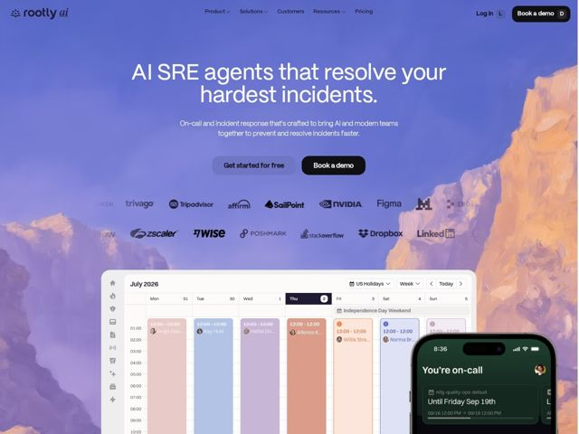

# Rootly — https://rootly.com

- **niche:** devops
- **mood:** premium-luxe
- **style:** photographic, gradient, glass
- **palette:** bg `#8E8FC4` · ink `#FFFFFF` · accent `#111114` — Pílulas CTA quase-pretas sólidas ("Book a demo", "Get started for free") e o dispositivo flutuante de mockup de telefone escuro contra a fotografia lavanda arejada; também o logo escuro da nav. O acento é a âncora escura, não um tom brilhante.
- **type:** display *General Sans (sans geométrica humanista quente; inferida pelos terminais arredondados + aberturas largas)* · body *Mesma família / peso mais leve — sans humanista suave, baixo contraste* — Quente, calma, amigável-engenheirada; nada estéril-techy
- **sections:** hero › logos › feature-root-cause › feature-on-call › feature-resolve-faster › feature-post-incident › feature-status-comms › problem-philosophy › how-it-works-pillars › cta › footer
- **signature:** Um pano de fundo fotográfico de montanha ao pôr do sol em full-bleed (pico lavanda dissolvendo em rocha laranja-quente) carrega todo o hero — a UI do produto (um calendário) e um iPhone glassy de mockup de plantão flutuam no terço inferior, sobrepondo-se à foto em vez de ficar numa seção contida. Natureza-como-hero para uma ferramenta de devops.
- **imagery:** Hero conduzido por fotografia (pico de montanha real enevoado, foco suave, gradiente de pôr do sol indo de lavanda fria a pêssego quente) usado como substituto atmosférico de gradient-mesh; o produto é mostrado literalmente via screenshots nítidos de UI em modo claro (calendário de plantão em visão semanal) mais um mockup realista de iPhone glassy flutuando sobre a foto. Premium, calmo, glassy.
- **copy:** Afirmação direta e centrada em resultado que nomeia a dor do comprador — hero: "AI SRE agents that resolve your hardest incidents." Os títulos de seção permanecem humanos e tranquilizadores ("On-call that puts you first—designed for everyday life.").

**Takeaways (roube como ideias, não copie):**
- Troque o obrigatório hero de devops em grade dark-mode por uma fotografia real com um gradiente de cor natural — o céu quente-frio faz o trabalho de gradiente sem um único mesh CSS.
- Combine uma sans display humanista suave (terminais arredondados) com CTAs sólidos quase-pretos para que a página leia premium-calma, não fria-corporativa.
- Deixe o produto flutuar: sobreponha um screenshot de UI em modo claro E um mockup de telefone glassy sobre a emenda da foto no terço inferior em vez de encaixotá-los numa faixa 'product' separada.
- Dê às seções de feature títulos emocionais e humanos ('puts you first', 'save yourself hours') em vez de substantivos de feature — venda alívio, não módulos.
